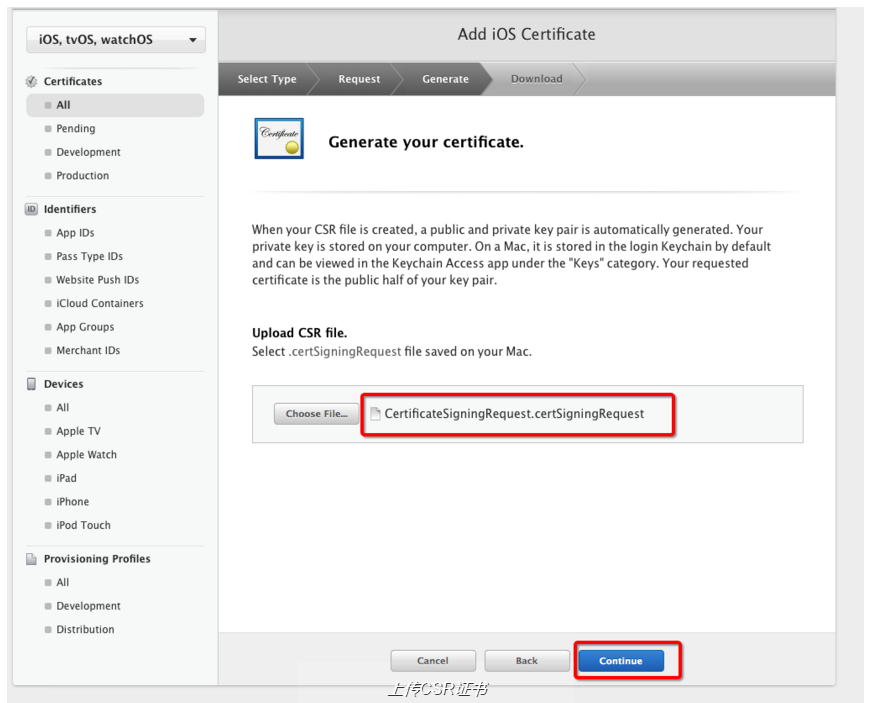
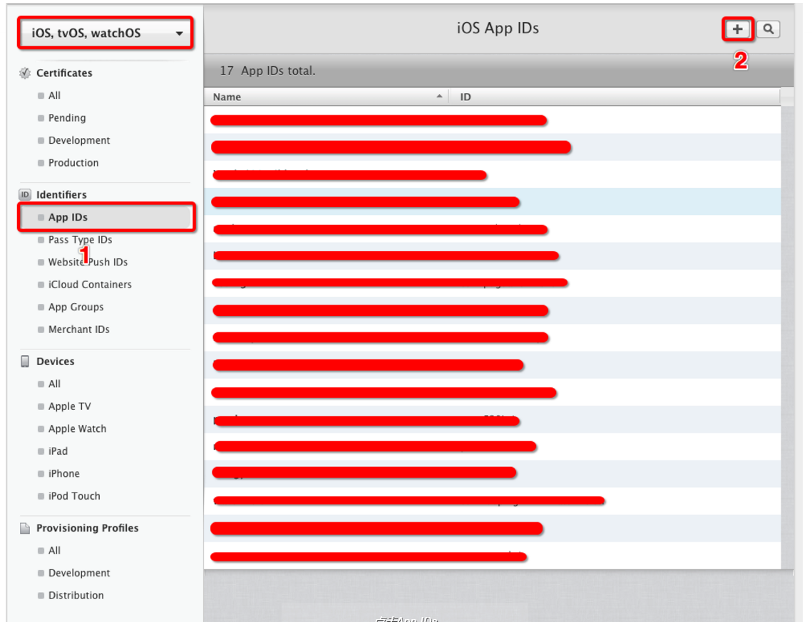
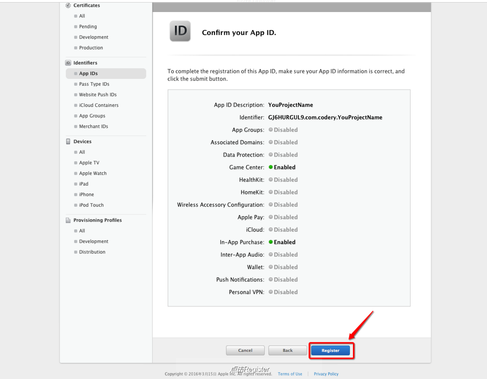
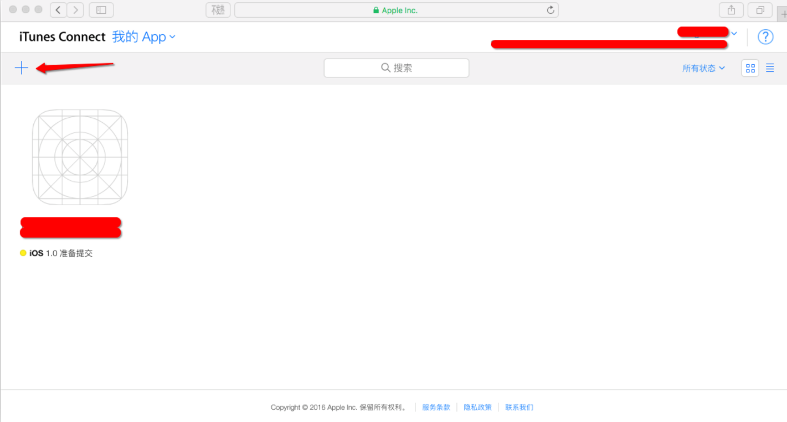
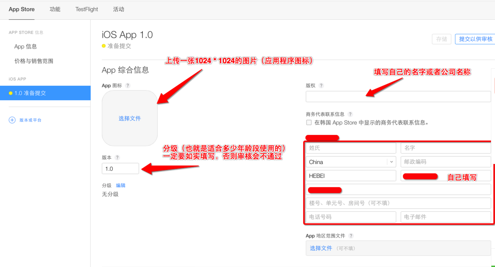
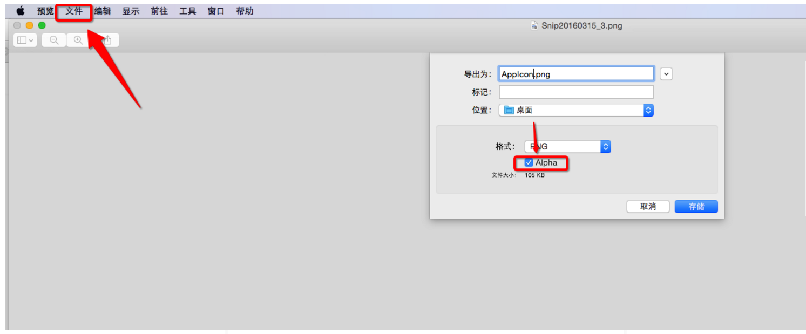
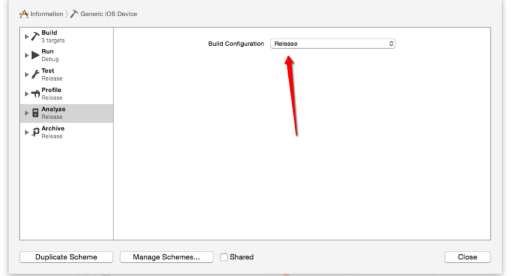

## 1> 账号准备
##### 已付费的开发者账号
- 个人（Individual）
- 公司（Company）
- 企业（Enterprise）
- 高校（University）

## 2> Xcode准备
##### 必须是正版的
- Xcode必须是正式版的，beta版本的Xcode是不能上传项目的

- 上传使用的 Mac 的 OS X系统必须也是正式版的，beta版本也不行

## 3> 生成发布证书

### 3.1> 进入苹果开发者中心：
- https://developer.apple.com

#### 3.1> 点击 Accourt 进入下图

#### 3.2> 点击 Certificates, Identifiers & Profiles (专门生成证书，绑定Bundle Id，绑定device设备，生成描述文件的地方)
- 选择iOS, tvOS, watchOS
- 选择All
- 点击右上角新添加证书
  

#### 3.3> 选择生产证书（选择App Store and Ad Hoc，APP
上传使用）

#### 3.4> 上传CSR文件去获取证书（CSR文件需要我们到本机钥匙串里去创建）

##### 在Launchpad的其他里面，点击钥匙串访问弹出如下界面

##### 工具栏选择钥匙串访问->证书助理->从证书颁发机构请求证书...

##### 选取位置，保存即可

##### 然后回到浏览器，点击choose File..

##### 选择创建好的：CertificateSigningRequest.certSigningRequest 文件，点击选取

##### 点击Generate上传证书

##### 跳转到如下界面，点击 DownLoad 下载生成的证书（cer后缀的文件），然后点击Done，你创建的发布证书就会存储在帐号中

###### 注意：这个证书只能下载一次。点击下载后，关闭页面后就不能再回到下载页面了
## 4> 创建App IDs和绑定你的App的Bundle Identifier

#### 4.1> 点击App IDs,进入如下界面，点击右上角的 + 号

#### 4.2> 填写App IDs和Bundle Identifier

##### 注意：
- 上传App使用的Bundle Identifier(不要有-，都是英文+数字)必须是固定的，不能使用占位符

- 如果你的Bundle Identifier已经在网站上绑定了，如果你又修改了你工程里面这个Bundle Identifier的话，需要重新进入到开发者账号里面绑定
  

#### 4.3> 选择App中包含的服务，默认有两项，其余的根据自己项目的需求进行选择

#### 4.4> 点击continue

#### 4.5> 点击Register

#### 4.6> 点击Done

## 5> 生成描述文件（描述文件的作用就是把证书和Bundle Identifier关联起来）
#### 5.1> 找到Provisioning Profiles ，点击All，然后点击右上角 + 号

#### 5.2> 因为是发布，所以选择下面App Store这个描述文件，点击Continue

#### 5.3> 在App ID 这个选项栏里面找到你刚刚创建的：App IDs（Bundle Identifier） 类型的套装，点击Continue

#### 5.4> 选择你刚创建的发布证书（或者生成p12文件的那个发布证书），根据自己电脑上的发布证书日期来选择，点击Continue

#### 5.5> 在Profile Name栏里输入一个名字（这个是PP文件的名字，可随便输入，在这里我用工程名字，便于分别），然后点击Generate

#### 5.6> Download生成的PP文件，然后点击Done，双击安装（闪一下就完事了，没其它效果）

## 6> 在App Store开辟空间

#### 6.1> 登录 itunes connect ，点击 我的app

#### 6.2> 点击左上角那个＋号，点击新建 iOS App

#### 6.3> 依次按提示填入对应信息（SKU是公司用于做统计数据之类的id，根据公司需求填写），然后点击创建

#### 6.4> 填写App其它信息

#### 6.5> 填写价格和销售范围

#### 6.6> 依次把不同尺寸的App截图拉入到对应的里面
- 在模拟器Command＋S 就可以保存屏幕截图到桌面了
- 如果提示拖进去的图片尺寸不对，则把模拟器弄成100%然后再Command 加 S

#### 6.7> 填写 App 简介

#### 6.8> app其他信息

- 如果上传App 图标失败，提示Alpha错误的话
  

#### 6.9> 填写分级信息

#### 6.10> 填写审核信息

###### 此时这个构建版本还没有生成，我们先把基本信息填写完毕，然后再进入Xcode中把项目打包发送到过来

## 7> 在Xcode中打包工程

#### 7.1> 在Xcode中选择iOS Device(这里不能选择模拟器)

#### 7.2> 如果你的应用不支持横屏，把这两个勾去掉

#### 7.3> 查看版本号和构建版本号

#### 7.4> 配置发布证书

#### 7.5> 将断点、全局断点，僵尸模式等都要去掉

#### 7.6> 设置Release模式

#### 7.7> 选择 Xcode下 Product 下 Archive（专门用于传项目，或者打包项目）

###### 出现下图说明你没有添加开发者账号，点击右下脚Add... 按钮就可以添加

###### 输入开发账号，可能会弹出下面界面

#### 7.8> 然后回到Archive(选择已付费的账号)，然后点击Choose

#### 7.9> 等待后，选择Upload提交

#### 7.10> 成功后，返回ItunesConnect网站上你自己的App信息中查看一下

#### 7.11> 在这个构建版本这里就可以添加代码

#### 7.12> 点击＋号之后选择代码版本

#### 7.13> 提交以供审核

## 8>另一种提交构建版本的方法

#### 8.1> 已经Archive的话，可以在Xcode: Window -> Organizer 进入

- 点击“Validate…”来验证一下
- 验证成功后，点击“Export...”，导出一个ipa文件

#### 8.2> 使用Application Loader 构建版本

#### 8.3> 打开Application Loader（如果没有登录，会提示你登录你的开发者账号）

###### 选取你导出的ipa文件（或者双击“交付您的应用程序”选取ipa文件）
###### 之后按提示操作就行，上传完毕没有报错的话，过几分钟左右就可以在iTunes Connect 里面就可以看到你上传的这个版本了

## 9> version 和 build概念对比

#### 8.1> version
- CFBundleVersion ("Bundle Version")，也就是我们看到的version
#### 8.2> build

- CFBundleShortVersionString ("Bundle version string, short")，也就是我们看到的Build

#### 8.3> 对比
- version我们可以通过App Store、itunes或其它软件看到，是给用户看的
- build是我们在团队开发中内部只用的，只有我们自己可以看到

## 注意：
### 账号创建证书有限
一个开发者账号只能创建（1-2个开发（测试）证书，2-3个生产（发布）证书），如果你的App Store Ad Hoc 前面的按钮不能选择，则代表你的这个账号无法再创建新的生产证书了

