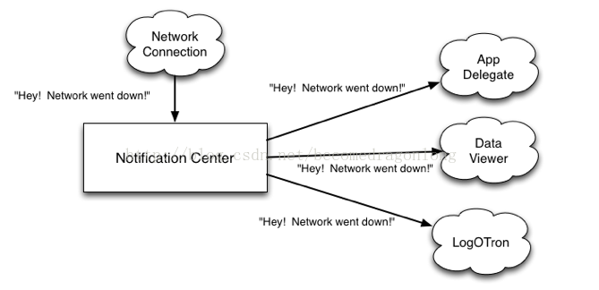
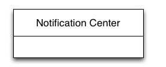
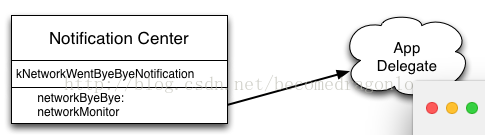
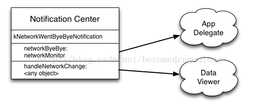
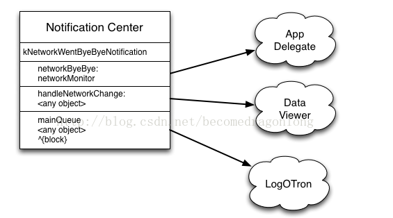

## 1> Notification 介绍
notification center像是一个中间人，对象可以通过它自由的像外界发送通知。这些发送通知的类不需要去继承特殊的类，也不需要实现特殊的接口。得益于OC的runtime机制，接收通知的类可以自定义任意selector去处理这些通知，而不需要实现任何接口和callback函数。
#### 图片


### 1.1> 注册Notification

接收通知的类需要告诉notification center他们对某些感兴趣。notification center就会讲这些类和他们的处理函数纪录在一个内部的列表中，就像是一个电话本。当你开始编程前，这个列表基本上就是一个空的。
s
#### 方式一：只接受networkMonitor对象发出的kNetworkWentByeByeNotification通知
```

// AppDelegate

NSNotificationCenter *center = [NSNotificationCenter defaultCenter];

[center addObserver: self

 selector: @selector(networkByeBye:)

 name: kNetworkWentByeByeNotification

 object: self.networkMonitor];

```
##### 添加完成


#### 方式二：接受任何对象发送的kNetworkWentByeByeNotification通知

```
// DataViewer

[center addObserver: self

 selector: @selector(handleNetworkChange:)

 name: kNetworkWentByeByeNotification

 object: nil nil];

```
上面代码中Object传的参数是nil。这说明只要有任何对象发出kNetworkWentByeByeNotification的通知，它都能接收到
##### 添加完成

#### 方式三：使用block版本的
```
// LogOTron
// _token is an instance variable of type 'id'
_token = [center addObserverForName: kNetworkWentByeByeNotification
 object: nil
 queue: [NSOperationQueue mainQueue]
 usingBlock: ^(NSNotification *notification) {
 NSLog (@"Network went down: %@", notification);
 }];

```
上述代码是要告诉notification center，“当任何对象发送kNetworkWentByeByeNotification通知，就将block放到这个queue中去执行”，notification center会将这和对象的注#册信息像前两次一样进行记录。
##### 添加完成


---
### 发送Nofication
```
NSNotificationCenter *center = [NSNotificationCenter defaultCenter];

 [center postNotificationName: kNetworkWentByeByeNotification

 object: self

 userInfo: userInfo];

```
### 注销通知
当一个对象对某一个通知不感兴趣之后，它应该从notification center中将注册信息注销掉。注销后，notification center就会删除关于改对象的记录信息，并断开和改selector的弱引用，但是如果使用的是block PAI的话，它还会保留对block的引用。所以这个时候要注意是否存在循环引用。当不再接收某个通知的时候，应该尽快的注销掉，或者在对象的dealloc时注销通知。

#### 注销所有通知

```
[center removeObserver: self];
```
将self中的所有注册的通知都注销掉,因为有时候有些通知是深藏于Coca中的，此时如果注销掉可能会造成系统异常。

#### 注销指定通知
```
[center removeObserver: self
 name: kNetworkWentByeByeNotification
 object: nil nil];
```
将kNetworkWentByeByeNotification通知注销掉的，但是其他的仍然保留
#### block 类型通知注销
因为这个通知和改对象没有任何关联，用上面两种方式是无法注销的。所以需要在注册block型的通知时，要将注册信息保留下来，然后在你不需要的时候，在通过这个保留的信息将通知注销掉，上面代码中，是用了一个token的变量保留block API的，这个token是一个notificationcenter类型的变量。

```
[center removeObserver: _token];

```
---
## Notification 传值
通知是最多可以携带一个参数的，这个参数是一个指向NSNotification的对象指针

```
- (void) networkByeBye: (NSNotification *) notification {
// handle the notification
} // networkByeBye

```
### NSNotification对象
NSNotification对象有3个参数：name，object，userinfo
##### name
notification的名字是一个NSString类型的，表示 通知事件的名称
##### object
这个参数是持有该Notification的对象
##### userinfo
这是一个NSDictionary类型的参数，里面包含着健值对，当通知被推送的时候，任何接收到该通知的都能收到这个参数。
因此你可以将需要传递的数据包装成一个NSDictionary即可

---


