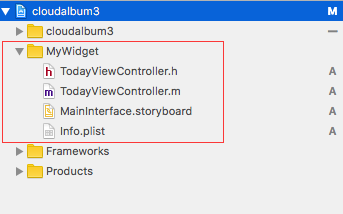
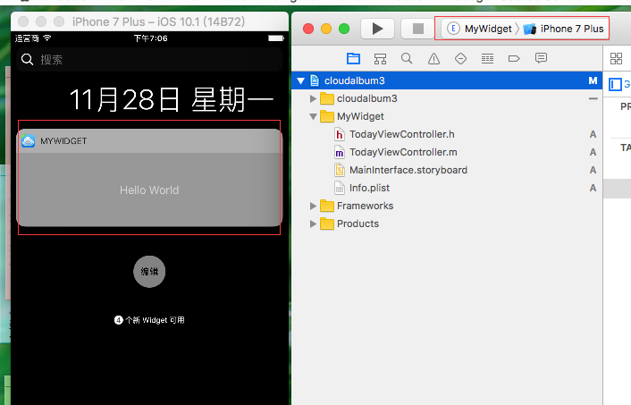
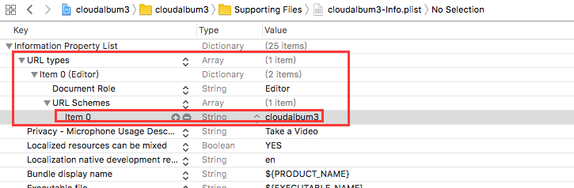
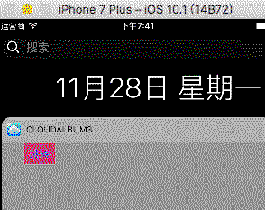
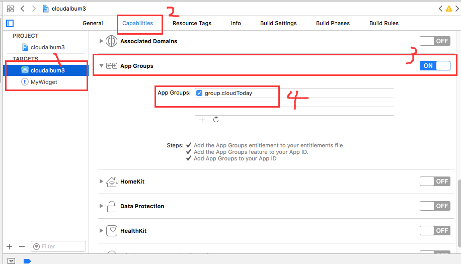
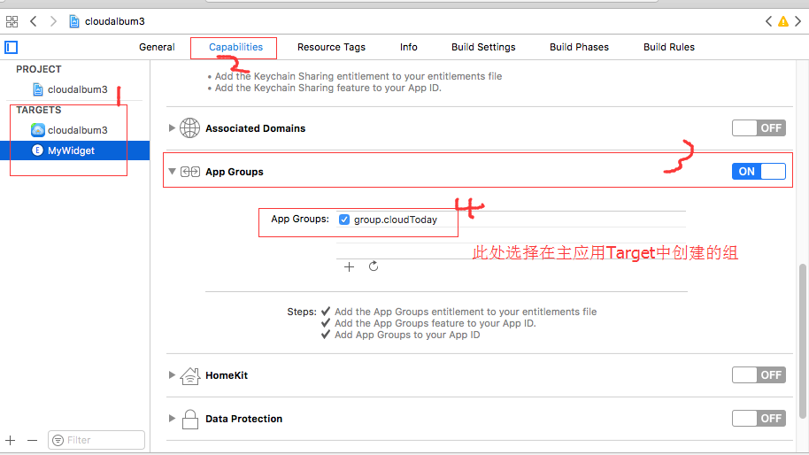
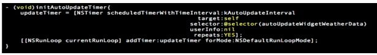

### 1> 创建
假设你已经有一个APP，现在要为它创建一个Today Widget 

**1> 用Xcode打开项目，选择File->New->Target，选择Today Extension**

**2> 输入名称->完成之后可在项目目录中看到**


**3> 运行该widget的效果(Scheme选为MyWidget)**


### 2> 初始界面&&UI样式

1> 系统给我们创建一个storyboard作为初始界面，并且使用了AutoLayout

###### 系统提供样式注意点
1、尽量不要使用背景，默认的毛玻璃效果很好，也比较统一


2、尽量保持默认的缩进，即左边会空几个像素


如果想改变默认缩进，有一个方法： 

```
-(UIEdgeInsets)widgetMarginInsetsForProposedMarginInsets:(UIEdgeInsets)defaultMarginInsets
{
    return UIEdgeInsetsZero;
}

```
#### 2.1> 代码布局
- 使用代码布局的话需要修改一下plist文件
- 
  将原有NSExtensionMainStoryboard字段删除，添加字段NSExtensionPrincipalClass，value是你所写的controller的名称，一般默认的都是TodayViewController
---
### 3> 跳转到主应用
在插件的storyboard上加几个按钮，分别跳转到主应用的不同页面 ,如何实现？？


- OpenUrl方法

  self.extensionContext其实就是Today这个app，然后有Today和主应用进行进程间通讯，里面很复杂，但方法封装的很简单，就是OpenUrl 
##### 代码

###### MyWidget中

```
-(void)jumpButClick:(id)sender{
    [self.extensionContext openURL:[NSURL URLWithString:@"cloudalbum3://action=GotoMainPage"] completionHandler:^(BOOL success) {
        NSLog(@"open url result:%d",success);
    }];
}
```

###### 主应用的AppDelegate中

```
- (BOOL)application:(UIApplication *)app openURL:(NSURL *)url options:(NSDictionary<UIApplicationOpenURLOptionsKey,id> *)options{
    NSString *prefix = @"cloudalbum3://action=";
    if ([[url absoluteString] rangeOfString:prefix].location != NSNotFound) {
        NSString* action = [[url absoluteString] substringFromIndex:prefix.length];
        if ([action isEqualToString:@"GotoMainPage"]) {
            [self switchRootViewController];
            
        }
        else if([action isEqualToString:@"GotoOrderPage"]) {
        }
    }}
```
##### 协议以及配置
- 协议名：cloudalbum3
- 主应用的plist中配置
  

##### 实现效果



### 4> 数据共享
插件怎么能获取主应用的数据呢？要知道插件和主应用是独立的两个进程，以前是无法共享数据的，现在可以通过AppGroup来共享数据，同属于一个group的App共同访问并修改某个数据。
##### 4.1> 创建Group

###### 4.1.1> 主应用的Target中


###### 4.1.2> MyWidget的Target中

- 注意：MyWidget中的组名选择 主应用的Target中创建的

#### 4.2> 读写数据(NSUserDefaults方式)

通过NSUserDefaults来读写数据，注意NSUserDefaults是根据刚才创建的group来创建的

###### 4.2.1> 主应用中创建数据

```
NSUserDefaults* userDefault = [[NSUserDefaults alloc] initWithSuiteName:@"group.huijia"];
[userDefault setObject:@"nmj" forKey:@"group.huijia.nickname"];
```

###### 4.2.2> 插件中获取数据

```
NSUserDefaults* userDefault = [[NSUserDefaults alloc] initWithSuiteName:@"group.huijia"];
    NSString* nickName = [userDefault objectForKey:@"group.huijia.nickname"];
    if (nickName) {
        NSString* message = @"今天XX又给你准备了很多惊喜哦，快去看看吧！";
        self.messageLabel.text = [NSString stringWithFormat:@"%@,%@",nickName,message];
    }
```

#### 4.3> 读写数据（NSFileManager）

###### 4.3.1> 主应用中创建数据
```
- (BOOL)saveDataByNSFileManager{ 
    NSError *err = nil; 
    NSURL *containerURL = [[NSFileManager defaultManager] containerURLForSecuri
tyApplicationGroupIdentifier:@"group.com.xxx"]; 
    containerURL = [containerURL URLByAppendingPathComponent:@"Library/Caches/
widget"]; 
    NSString *value = @"asdfasdfasf"; 
    BOOL result = [value writeToURL:containerURL atomically:YES encoding:NSUTF8StringEncoding error:&err];
    if (!result) { 
        NSLog(@"%@",err); 
    } else { 
        NSLog(@"save value:%@ success.",value); 
    } 
    return result;
}

```
###### 4.3.2> 插件中获取数据

```
- (NSString *)readDataByNSFileManager{ 
    NSError *err = nil;
    NSURL *containerURL = [[NSFileManager defaultManager] containerURLForSecuri
tyApplicationGroupIdentifier:@"group.com.xxx"]; 
    containerURL = [containerURL URLByAppendingPathComponent:@"Library/Caches/
widget"]; 
    NSString *value = [NSString stringWithContentsOfURL:containerURL encoding:
NSUTF8StringEncoding error:&err]; 
    return value;
}

```

### 5> 定时更新

###### 5.1> 自身更新机制

 Widget自身更新机制当用户下拉通知中心(Notification Center)时立即更新数据

###### 5.2> 自定义的刷新(NSTimer)

- NSTimer触发时机

- viewWillAppear 中触发

- viewDidDisappear 中取消




### 6> iOS10之后的展开布局
##### 6.1> 设置Widget的size

```
- (void)viewDidLoad {
    [super viewDidLoad];
    // Do any additional setup after loading the view from its nib.
    
    if (isIOS10)
    {
        self.extensionContext.widgetLargestAvailableDisplayMode = NCWidgetDisplayModeExpanded;
    }
    
    self.preferredContentSize = CGSizeMake(kWidgetWidth, 110);
}
```
##### 6.2> 重写展开及折叠
```
- (void)widgetActiveDisplayModeDidChange:(NCWidgetDisplayMode)activeDisplayMode withMaximumSize:(CGSize)maxSize
{
    NSLog(@"maxWidth %f maxHeight %f",maxSize.width,maxSize.height);
    
    if (activeDisplayMode == NCWidgetDisplayModeCompact)
    {
        self.preferredContentSize = CGSizeMake(maxSize.width, 110);
    }
    else
    {
        self.preferredContentSize = CGSizeMake(maxSize.width, 200);
    }
}
```

### 7> Widget横屏支持


### 8> Widget国际化

### 参考链接
1> http://www.cocoachina.com/ios/20150702/12337.html


