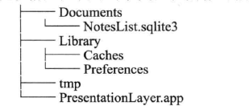
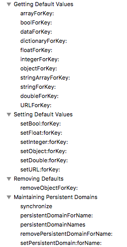

#  ios数据安全介绍
- ios应用程序只能访问自己的目录：即沙箱目录
- ios应用程序之间禁止数据的共享和访问。但是可以通过一些特定的api来访问特殊的应用（例：联系人，相册等）

#### 沙箱目录
##### 原理 
- 只允许自己的应用访问目录，不允许其他的应用访问

##### 目录
- 模拟器上应用的目录为

```
/Users/DayByDay/Library/Developer/CoreSimulator/Devices/FA6C2B57-08F0-4C3F-9DE7-DF662998F75D/data/Containers/Data/Application/08F5660E-5C75-4078-BB59-3182157C074C

```
- 其中：08F5660E-5C75-4078-BB59-3182157C074C为应用程序ID，在安装的时候由系统分配
- 解释了为什么模拟器上每次运行程序，其ID都不一样

##### 沙箱内目录

###### Documents目录
- 用来存储频繁更新的数据，且可以进行itunes或者icloud备份
- 路径获取方式为

```
NSArray *documentPath = NSSearchPathForDirectoriesInDomains(NSDocumentDirectory, NSUserDomainMask, YES);
NSString *path = [documentPath firstObject];

```
- 由于在mac上，document可能对应多个文件夹，因此返回的类型为array类型
- 但是在ios上，一个应用只对于一个document，因此，取出一个即可

###### Library目录
- preferences：可用来存储程序的设置数据
- caches     ：可用来存放程序的数据 和 缓存文件

###### tmp目录
- 临时文件，可能会被删除

```
NSString *tmpDir = NSTemporaryDirectory();

```
- - -
# 持久化存储方式
## 一. Archiving(固化)
---
#### 1.1 保存数据
##### 1.1.1 获取保存路径
- 得到沙盒中document的目录
- 拼接路径：    stringByAppendingPathComponent
- 文件名：      items.archive

```
#pragma mark - 获取文件路径
- (NSString *)itemArchivePath
{
    /**
     *  NSSearchPathForDirectoriesInDomains得到沙盒中的某种目录的全路径
     *
     */
    NSArray *documentDirectories = NSSearchPathForDirectoriesInDomains(NSDocumentDirectory, NSUserDomainMask, YES);
    /**
     *  在ios中，一种目录类型只会有一个匹配的目录（应用沙盒的原因）；但是在MAX OS上可能有多个目录匹配
     *  因此，NSSearchPathForDirectoriesInDomains返回的是NSArray，但ios只会取第一个也是唯一的一个NSString对象
     */
    NSString *documentDirectory = [documentDirectories firstObject];
    /**
     *  返回路径；使用stringByAppendingPathComponent不需要添加“／／”
     */
    return [documentDirectory stringByAppendingPathComponent:@"items.archive"];
}
```

##### 1.1.2 保存数据
- 创建一个NSKeyedArchiver对象
- 发送encodeWithCoder：消息
- 编码到同一个NSKeyedArchiver对象中
- NSKeyedArchiver对象就会将数据写入指定的文件
- privateItems为一个数组，数组里面存储的是Item对象

```
#pragma mark - 应用退出时，保存数据
/**
 *  应用退出时，保存数据
 */
- (BOOL)saveChanges
{
    /**
     *  获取需要保存的路径
     */
    NSString *path = [self itemArchivePath];
    NSLog(@"%@",path);
    /**
     *  [NSKeyedArchiver archiveRootObject:self.privateItems toFile:path]执行流程：
     *  1.archiveRootObject: toFile首先创建一个NSKeyedArchiver对象（NSKeyedArchiver是NSCoder的具体实现子类）
     *  2.archiveRootObject: toFile会向privateItems发送encodeWithCoder：消息，并传入NSKeyedArchiver作为第一参数
     *  3.privateItems的encodeWithCoder：方法会向其包含的所有BNRItem对象发送encodeWithCoder：消息，并传入同一个NSKeyedArchiver对象。
            这些BNRItem对象会将其属性编码到同一个NSKeyedArchiver对象中
     *  4.当privateItems中所有对象都编码完成，NSKeyedArchiver对象就会将数据写入指定的对象
     */
    return [NSKeyedArchiver archiveRootObject:self.privateItems toFile:path];
}
```

##### 1.1.3 Item 对象执行encodeWithCoder：方法

###### Item.m文件

```
#pragma mark - 固化delegate
-(void)encodeWithCoder:(NSCoder *)aCoder
{
    [aCoder encodeObject:self.itemName forKey:@"itemName"];
    [aCoder encodeObject:self.serialNumber forKey:@"serialNumber"];
    [aCoder encodeObject:self.dateCreated forKey:@"dateCreated"];
    [aCoder encodeInt:self.valueInDollars forKey:@"valueInDollars"];
}
```
##### 1.1.4 写入完成
---
#### 2.1 读取数据

```
 NSString *path = [self itemArchivePath];
 _privateItems = [NSKeyedUnarchiver unarchiveObjectWithFile:path];
```
- unarchiveObjectWithFile:方法会创建一个NSKeyedUnarchiver对象，并载入固化文件
- 该NSKeyedUnarchiver对象查看固化文件中根对象，并创建之
- NSKeyedUnarchiver对象向新创见的对象发送initWithCorder:消息，并将 NSKeyedUnarchiver作为实参传入
- 向所有解固的对象发initWithCorder:消息

#### 2.2 接收initWithCorder:消息
###### Item.m文件

```
- (instancetype)initWithCoder:(NSCoder *)aDecoder
{
    self = [super init];
    if(self)
    {
        _itemName       = [aDecoder decodeObjectForKey:@"itemName"];
        _serialNumber   = [aDecoder decodeObjectForKey:@"serialNumber"];
        _dateCreated    = [aDecoder decodeObjectForKey:@"dateCreated"];
        _valueInDollars = [aDecoder decodeIntForKey:@"valueInDollars"];
    }
    return self;
}
```


## 一. NSUserDefaults

##### 介绍

* 用户轻量级的数据持久化，主要用于保存用户程序的配置等信息，以便下次启动程序后能恢复上次的设置。
* 以“键值对”形式保存的\(类似于NSDictionary\)

##### 保存位置

```
/Library/Prefereces，里面有个plist文件，存储的就是你的userDefaults.

```

##### 删除

```
removeObjectForKey或者删掉沙盒
```

##### 存储

```
NSUserDefaults * defaults = [NSUserDefaults standardUserDefaults];
NSString * adate = @"success!";
[defaults setObject:adate forKey:@"adate"];
[defaults synchronize]; //同步到磁盘
```

##### 取出

```
NSUserDefaults * _defaults = [NSUserDefaults standardUserDefaults];
NSString * _adate = [_defaults objectForKey:@"adate"]; 
```



---

# 二. NSKeyedArchiver

---

