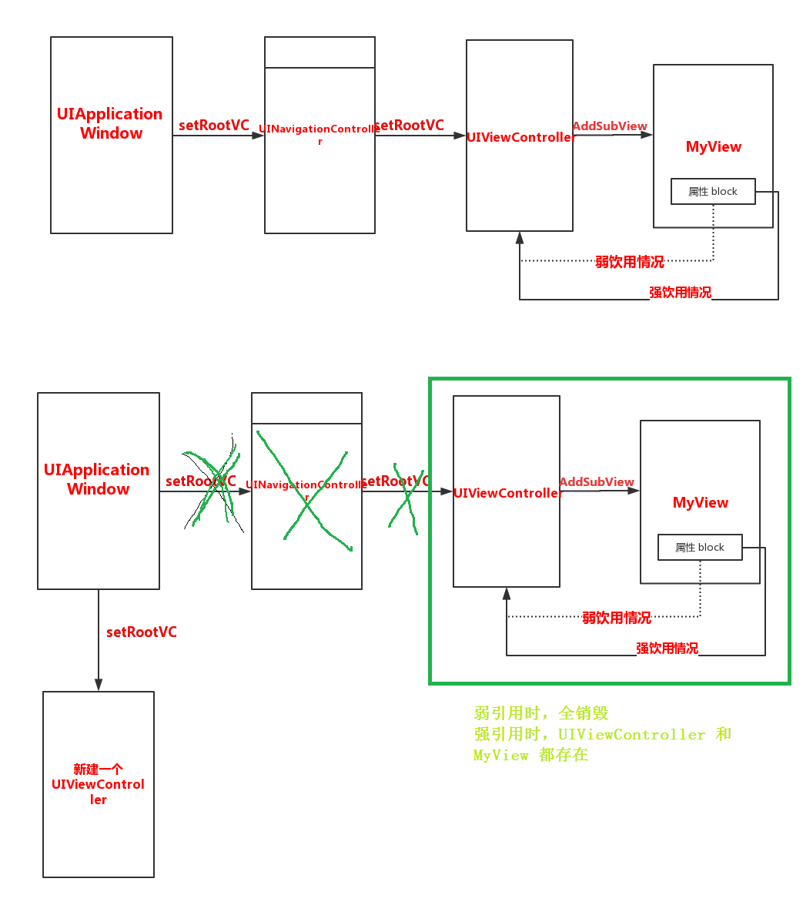
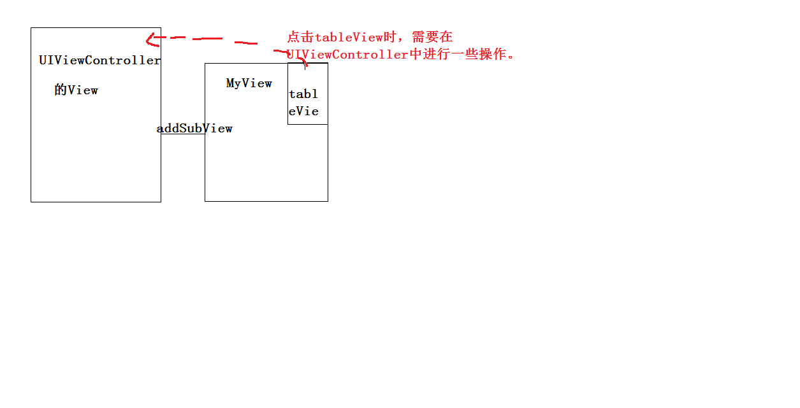

## 1> 循环引用
#### 1.1> 图片描述

#### 1.2> UIViewController.m代码
##### 1.2.1> 强引用代码
```
MyView *view = [MyView viewWithDataArray:self.dataArray clickTableBlock:^(MyViewModel *model){
            /**
             *  在 myview 中 点击 tableview 时，调用此
             */
            NSLog(@"%@ CLICKED",model.name);
            [self removePopView];
            
        } andBGBlock:^(){
            /**
             *  在 myview 中 点击 背景 view 时，调用
             */
//            [self removePopView];
            //[weakSelf.view removeFromSuperview];
            /**
             *  在 myview 中 点击 背景 view 时，调用
             *  更换 window 的rootVC,即 销毁 UINavigationControler 对UIViewCOntroller的强饮用，正常情况UIViewController应当背销毁（如果有循环饮用，则不会）
             */
            [[[[UIApplication sharedApplication] delegate] window] setRootViewController:[[UIViewController alloc] init]];
        }];
        [self.view addSubview:view];
```
##### 1.2.2> 若引用代码
```
__weak typeof(self) weakSelf = self;
        MyView *view = [MyView viewWithDataArray:self.dataArray clickTableBlock:^(MyViewModel *model){
            /**
             *  在 myview 中 点击 tableview 时，调用此
             */
            NSLog(@"%@ CLICKED",model.name);
            [weakSelf removePopView];
            
        } andBGBlock:^(){
            /**
             *  在 myview 中 点击 背景 view 时，调用
             */
//            [self removePopView];
            //[weakSelf.view removeFromSuperview];
            /**
             *  在 myview 中 点击 背景 view 时，调用
             *  更换 window 的rootVC,即 销毁 UINavigationControler 对UIViewCOntroller的强饮用，正常情况UIViewController应当背销毁（如果有循环饮用，则不会）
             */
            [[[[UIApplication sharedApplication] delegate] window] setRootViewController:[[UIViewController alloc] init]];
        }];
        [self.view addSubview:view];
    }
```
##### 1.3> 分析
######  强引用情况
1> 如果 是 先 删除 MyView (即remove form superView).则UIViewController 到 MyView 的强引用线被删除，此时MyView 被 dealloc，其 block 到 UIViewController 的强引用线同样自动被删除，此时在更改UIWindow 的rootVC，则UIViewController 可以被删除。

2> 如果直接UIWindow 的rootVC,则UIViewController  和MyView 和 block 3个形成一个 循环引用圈，不会被销毁

## 2> block 回调
#### 2.1> 使用情景

#### 2.2> 描述
1> 创建的一个MyView 添加到 UIViewController 的 View中

2> MyView中有一个 TableView

3>点击 TableView 时，需要在 UIViewController中进行一些操作

#### 2.3> 使用block 回调
1> 创建MyView 的时候，同时 传递一个 block，该block中为 点击TableView时，需要进行的操作

2> 在MyView中添加 block 属性，将 传入的 block 进行保存

3> 在MyView中点击TableView 时，调用 block

4> UIViewController中的block代码会执行

#### 2.4> 使用 代理（UIViewcontroller 做 MyView 的代理），或者 通知监听机制，也可以实现
---
#### 2.5> block 做属性时，为何需要copy？？

## 3>代码
https://github.com/Land-Fairy/myPopView.git
