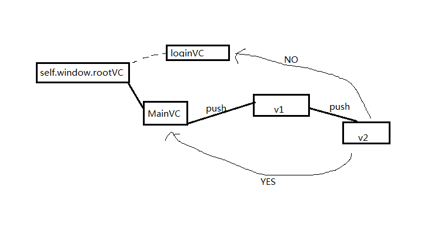

### 软件第一次登入时，根视图设为login；否则，根视图设为main
```objective-c
- (BOOL)application:(UIApplication *)application didFinishLaunchingWithOptions:(NSDictionary *)launchOptions
{
    self.window = [[UIWindow alloc] initWithFrame:[[UIScreen mainScreen] bounds]];
        
    if ([[NSUserDefaults standardUserDefaults] boolForKey:@"firstLaunch"]) {
        //第一次启动导航页
        NSLog(@"wanggsx:第一次启动");
        ViewController *appStartController = [[ViewController alloc] init];
        self.window.rootViewController = appStartController;
        [self.window addSubview:appStartController.view];
    }
    else
    {
        //打开选择场地界面
        [self switchRootViewController];
    }
    [self.window makeKeyAndVisible];
    return YES;
}

//切换RootViewController
- (void)switchRootViewController
{
    self.window.rootViewController = nil;
    ChooseModeViewController* crBrandsViewController= [[ChooseModeViewController alloc] init];
    UINavigationController *brandsNavigationController = [self customControllerWithRootViewController:crBrandsViewController];
    self.viewController = brandsNavigationController;
    self.window.rootViewController = self.viewController;
}
```
```objective-c
- (IBAction)gotoMainView:(id)sender {
    [[NSUserDefaults standardUserDefaults] setBool:NO forKey:@"firstLaunch"];
    [(AppDelegate*)[UIApplication sharedApplication].delegate switchRootViewController];
}
```

### appDelegate的rootviewcontroller切换影响


- 如图，现在在v2的逻辑中，需要进入一个条件判断，如果为yes,则跳转到mainVC;如果是no，则需要跳转到loginVC.
- 由于跳转过后，需要mainVC 或者loginvc重新加载（比如重新执行viewDidLoad函数），不能直接pop或者push
- 解决：由于mainVC 或者 loginVC 均可由self.window.rootViewController达到，因此可重新设置self.window.rootViewController的值
- 影响：重置self.windows.rootViewController的值之后，原来在内存中的，MainVC,V1,V2都会收到一条release消息（是否调用dealloc，看其引用计数是否为0！）

