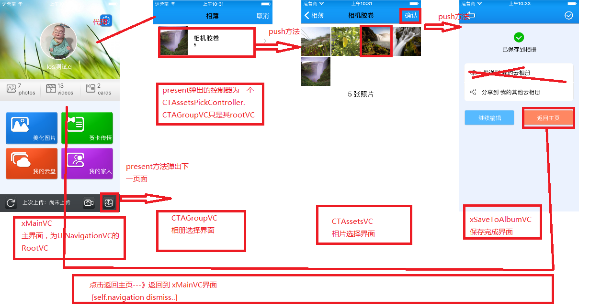

## 1> UINavigation present another UINavigation
#### 1.1> 图片描述



#### 1.2> Q&&A
---

**1> xMainVC  present 方法弹出了另一个 UINavigation,则在最后的xSaveToAlbumVC界面，怎么直接返回到 xMainVC？**

答：**[self.navigation  dismiss..]**即可，**dismiss会清除最后一次present的页面**，
CTAssetsPickerController的清除，导致存储在栈里面的对象都会呗清除

---

**2> CTAssetsVC 界面点击 确定按钮时，需要使用 xMainVC中的函数来进行处理（注意：CTAssetsPickerController的代理为xMainVC）**

答：

    法一：可以将 CTAssetsVC 的 代理 设置为 xMainVC

    法二：由于 CTAGroupVC的代理为xMainVC，因此可以直接使用现成的

```
//在CTAssetsVC的确定按钮处理中
CTAssetsPickerController *pvc = （CTAssetsPickerController *）self.navigation;
[pvc.delegate 需要调用的方法]；

```

上述，可以使用self.navigation来获取CTAssetsPickerController，然后使用现成的方法即可，省去了在此设置代理。

---

**3> 第2个问题中，xMainVC中的函数来进行处理，其处理是异步的，现在想要在其 异步完成之后，CTAssetsVC push一个新的界面**

答： 

    1> 如果xMainVC  CTAssetsVC在同一个栈中，则可以使用[self.navigation push..];当前不可行

​    
    2> 由于xMainVC  CTAssetsVC在不同的 UINavigationController中，可以使用**通知监听机制**

```
//CTAssetsVC的确认按钮处理中
添加监听，并设置监听完成调用方法
//xMainVC 处理逻辑中
处理完成之后，发送通知

//CTAssetsVC的调用方法中
在此方法中，首先应当清除监听事件
push下一个页面
```
# 2> 视图控制器的集中创建方式
## 2.1> 通过代码创建视图，并设置为窗口的根视图控制器
##### 2.1.1> 新建BNRHypnosisViewController类，继承自UIViewController
- 对于从UIViewController中继承的viewcontroller,其有一个重要属性
```
@property(null_resettable, nonatomic,strong) UIView *view; 
```
- UIViewController对象可以管理一个视图层次结构，view为该视图层次结构的跟视图。
- 当将view作为子视图加入窗口时，其会自动加入rootViewController对应的整个视图层次结构
  
- 懒加载（视图），视图控制器不会在被创建的时候便加在相应的视图，只有当应用需要显示视图时，才加载。
---
##### 2.1.2> 通过代码方式创建视图：
- 当视图控制器刚被创建时，其view为nil。
- 当应用需要显示该view时，如果view为nil，自动掉用 loadView方法
```
- (void)loadView
{
    // Create a view
    CGRect frame = [UIScreen mainScreen].bounds;
    BNRHypnosisView *backgroundView = [[BNRHypnosisView alloc] initWithFrame:frame];

    // Set it as *the* view of this view controller
    self.view = backgroundView;
}
```
---
##### 2.1.3> 设置根视图控制器
- 使用UIWindow的setRootViewController方法。
- 当程序将视图控制器设为窗口的rootViewController时，会自动将该视图控制器的view作为子视图加入窗口，并且调整view的大小为窗口的大小。

```
- (BOOL)application:(UIApplication *)application didFinishLaunchingWithOptions:(NSDictionary *)launchOptions
{
    self.window = [[UIWindow alloc] initWithFrame:[[UIScreen mainScreen] bounds]];
    // Override point for customization after application launch.


    BNRHypnosisViewController *hvc = [[BNRHypnosisViewController alloc] init];

    self.window.rootViewController = hvc;

    self.window.backgroundColor = [UIColor whiteColor];
    [self.window makeKeyAndVisible];
    return YES;
}
```

- BNRHypnosisViewController 的初始化方法为


```
- (id)initWithNibName:(NSString *)nibNameOrNil bundle:(NSBundle *)nibBundleOrNil
{
    self = [super initWithNibName:nibNameOrNil bundle:nibBundleOrNil];
    //
    if (self) {

        //do something
    }

    return self;
}
```
---
###### initWithNibName:...方法

- 1） 该方法为viewcontroller使用的默认初始化方法，如果该视图控制器为UIViewController的子类，还需要掉用其  ``` super 方法```
- 2） 默认的 init方法会调用此方法，并且将两个参数都设置为nil
- 3）当使用NIB的时候，还需要将NIB中的File's Owner设置为该视图控制器，并且还需要将File's Owner右键的view连线到NIB的主view
- 4）如果没有指定NIB文件， ``` - loadView```函数会试图加载与该控制器同样名字的NIB文件，如果找到就加载；如果不存在，则或者在view被使用之前，通过``` - setView ```来设置一个view，或者重写 ``` - loadView```方法来设置view
---

## 2.2> 使用nib创建视图

#### 2.2.1> 关联File's Owner

- File's Owner对象是一个占位符对象
- 当视图控制器将XIB加载为NIB时，首先创建XIB中所有视图对象，然后需要将自己填入对应的File's Owner空洞中，便与nib 建立了关联
- 将File's Owner的view，与XIB中的view建立关联，则在载入该XIB文件时，view便有值。
---

#### 2.2.2> IBOutlet声明为弱引用


- 由于当系统中可用内存较少时，视图控制器会自动释放其视图，并在后面需要时在创建，使用弱饮用便于在释放view时能释放view的所有子视图，避免内存泄露

---

