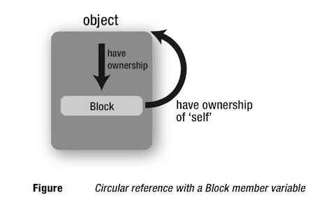

# 1> UIViewController的retainCount奇怪之处

```
1> UIViewController * subVC = [[UIViewController alloc] init];//这里subVC的retainCount=1
2> [mainView addSubview:subVC.view];//这里subVC的retainCount =3,增加了2
3> [subVC.view removeFromSuperview];   //这里subVC的retainCount为4；增加了1
4> [subVC release];//这里subVC引用计数为3，减少了1
```

* 本来，按照我们的期待，在地4步的时候，引用计数应当为0，并且调用dealloc，但实际并不是这样！

---

#### 1.1> 验证

* 1&gt; 将这个指针在指针在第4步之后保存下来
  ```
  UIViewController * temp = subVC；//作为全局变量
  ```

* 2&gt; 等一段时间后，调用 temp.retainCount，这个时候代码会crash.说明temp已经是无效的指针

---

#### 1.2> 结论

* UIViewController在做removeFromSuperView的时候是delay，并且做了一次autorelease（不知道出于说明目的，或许是为了防止动画），等所有动作完成，其将所有的retainCount减为0.- 
* 上面的这种写法虽然最后retainCount不为0，但代码没有错，也没有内存泄露。
* 因此只要保证进行了和分配添加相反地操作，内存就应该被释放的。

# 2> UIViewController 被POP

#### 2.1> 误区 ：并不是被pop就会调用 dealloc

* UIViewController 被POP的时候，只是会发送一条 **release消息**，该viewcontroller是否调用dealloc，还要看其他地方对其有强引用（或起retainCount是否为0）！

---

#### 2.2> 常见的控制器被强引用的原因

##### 2.2.1> 控制器中NSTimer没有被销毁

```
[NSTimer scheduledTimerWithTimeInterval:1.0 
    target:self 
    selector:@selector(updateTime:) 
    userInfo:nil 
    repeats:YES
];
```

* 因为 **target:self** ，也就是引用了当前viewController，导致控制器的引用计数加1，如果没有将这个NSTimer 销毁，它将一直保留该viewController，无法释放，也就不会调用dealloc方法
* 解决：需要在**viewWillDisappear之前**需要把控制器用到的NSTimer销毁。

```
[timer invalidate]; // 销毁timer
timer = nil; // 置nil
```

---

##### 二 . viewController中的代理不是weak属性

```
@property (nonatomic, weak) id delegate;代理要使用弱引用

```

* 由于 本来 代理对象（一般为视图控制器）对于 被代理的对象（自定义的控件，需要对视图控制器回传值） 就是强引用关系，如果被代理 又使用强引用到代理对象，则会造成循环引用

---

##### 三. viewController中block的循环引用

* 在ARC下，block会把它里面的所有对象强引用，包括当前控制器self，因此有可能会出现循环引用的问题
* 比如viewController中有个block属性，在block中又强引用了self或者其他成员变量，那么这个viewController与自己的block属性就形成循环引用，导致viewController无法释放。
  
  ###### 注意：上面所获的循环引用，首先是 self强引用了block！！如果只是在block中强引用self，则并不会造成循环引用！

* 解决：ARC下可以用：\_\_weak修饰符修饰变量self;MRC下可以用：
  ###### 注意变形


```
@interface MyObject : NSObject
{
   myBlock  blk;
   id _obj; 
}
@end
@implementation MyObject 

- (id)init
{
     self = [super init];
     blk = ^{ NSLog(@"_obj = %@", _obj); }; 
     return self;
}
...
...
@end

```

* 虽然没有直接使用 self，却也存在循环引用的问题。因为对于编译器来说，\_obj就相当于self-&gt;\_obj
* ???

---

##### 四：使用AFHTTP

* 在使用该进行网络任务的时候，会对viewcontroller进行retain，导致，如果任务没有完成，则viewcontroller不会杯释放！

