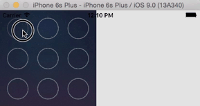

#### 1.6.1 滑动解锁

- 效果



- 实现分析

> 1>  自定义 一个 view，来实现 该效果（其他地方使用可以直接拖过去用）
>
> 2> 手指 拖动的时候，移动到 按钮 范围，按钮 变为  选中状态
>
> 3> 画出来的线 分为 两个部分
>
> - 1.已经选中 按钮 之间 的连线（已经选中 按钮 需要有顺序）
> - 2.最后一个 按钮 与 当前手指点 的 连线
>
> 因此：
>
> - 1.用一个 数组 保存 每一次选中 的 按钮（每个按钮只被添加一次）
> - 2.先画 按钮 与 按钮之间 的连线
> - 3.然后画  按钮 与 当前手指点 处 的连线
>
> 4> 手指停止拖动的时候，清空所有

- 代码

```objective-c
//
//  UIGestureView.m
//  DrawLine
//
//  Created by Mac on 17/3/8.
//  Copyright © 2017年 Mac. All rights reserved.
//

#import "UIGestureView.h"
#define butW 50
#define butCount 3
@interface UIGestureView()
@property (nonatomic, strong) NSMutableArray *selectedButArray;
@property (nonatomic, assign) CGPoint currentPoint;
@end

@implementation UIGestureView


- (void)drawRect:(CGRect)rect {
    /**
     *  背景颜色 需要 画上去！！ 如果使用 UIImageView，则 下面 画的路径 会在 UIImageView的底部，被遮挡
     */
    UIImage *bgImage = [UIImage 
                        	imageNamed:@"Home_refresh_bg"];
    [bgImage drawInRect:rect];
    
    UIBezierPath *path = [UIBezierPath bezierPath];
    
    for (int i=0; i<self.selectedButArray.count; i++) {
        /**
           *  如果是第一个but，需要 先  moveTo
           */
        if (i == 0) {
            [path moveToPoint:
             ((UIButton *)self.selectedButArray[0]).center];
        }
        else{
            /**
                *  如果是其他 but，添加线到这些点就好
                */
           [path addLineToPoint:
            ((UIButton *)self.selectedButArray[i]).center];
            
        }
        /**
           *  如果是最后一个 but，则需要添加点 到 手指当前位置
           */
        if (i == self.selectedButArray.count -1) {
            [path addLineToPoint:self.currentPoint];
        }
    }
    [[UIColor redColor] set];
    [path setLineWidth:10];
    [path setLineJoinStyle:kCGLineJoinRound];
    [path stroke];
}

- (instancetype)initWithFrame:(CGRect)frame{
    if (self = [super initWithFrame:frame]) {
        [self setUpSubViews];
    }
    return self;
}

- (void)setUpSubViews{

    /**
     *  添加 9 个按钮
     */
    for(int i=0; i<9; i++){
        UIButton *but = [UIButton 
                         buttonWithType:UIButtonTypeCustom];
        [but setImage:[UIImage 
                        imageNamed:@"gesture_node_normal"] 
         				forState:UIControlStateNormal];
        [but setImage:[UIImage 
                        imageNamed:@"gesture_node_selected"] 						 forState:UIControlStateSelected];
        but.tag = 100+i;
        [but addTarget:self action:@selector(butClicked:) 			forControlEvents: UIControlEventTouchUpInside];
        [self addSubview:but];
    }
    /**
     *  添加 拖动手势
     */
    UIPanGestureRecognizer *panGesture = 
      				[[UIPanGestureRecognizer alloc] 
       					initWithTarget:self 
       					action:@selector(panGesture:)];
    [self addGestureRecognizer:panGesture];
    
}

- (void)layoutSubviews{
    
    /**
      *  设置 9 个按钮的位置
      */
    // 水平 与 垂直 按钮 的间距
    CGFloat horSpacing = (self.bounds.size.width - 
                          butW*butCount)/(butCount +1.);
    CGFloat verSpacing = (self.bounds.size.height - 
                          butW*butCount)/(butCount +1.);
    CGFloat x =0.;
    CGFloat y =0.;
    for (int i =0; i<self.subviews.count; i++) {
        if (self.subviews[i].tag>=100 && self.subviews[i].tag < 109) {
            UIButton *but = self.subviews[i];
            x = (but.tag - 100)%butCount * 
              				(horSpacing + butW) + horSpacing;
            y = (but.tag - 100)/butCount * 
              				(verSpacing + butW) + verSpacing;
            but.frame = CGRectMake(x, y, butW, butW);
        }
    }
    
}

- (NSMutableArray *)selectedButArray{
    if (!_selectedButArray) {
        _selectedButArray = [NSMutableArray array];
    }
    return _selectedButArray;
}

/**
 *  按钮 被点击
 */
- (void)butClicked:(UIButton *)sender{
    sender.selected = YES;
}

/**
 *  将按钮 添加 到 已选中按钮数组中去
 */
- (void)addButToArray:(UIButton *)but{
    if (![self.selectedButArray containsObject:but]) {
        [self.selectedButArray addObject:but];
    }
}

/**
 *  判断 当前 手指 是否在 按钮 范围内，如果在，将按钮 添加到 已选中按钮数组去
 */
- (void)judgeAndButContainsPoint:(CGPoint)point{
    for (int i =0; i<self.subviews.count; i++) {
        if (self.subviews[i].tag>=100 && self.subviews[i].tag < 109 ) {
            UIButton *but = self.subviews[i];
            /**
                *  判断点 是否 在 矩形 范围内
                */
            if (CGRectContainsPoint(but.frame, point)) {
                [self butClicked:but];
                [self addButToArray:but];
            }
        }
    }

}

- (void)clearAllDraw{
    /**
     *  首先 清空 but 的选中 效果
     */
    for (int i= 0; i<self.selectedButArray.count; i++) {
        UIButton *but = self.selectedButArray[i];
        but.selected = NO;
    }
    
    /**
     *  清空 已选中 数组
     */
    [self.selectedButArray removeAllObjects];
    
    
}

/**
 *  手指 在屏幕 上拖动
 */
- (void)panGesture:(UIPanGestureRecognizer *)pan{
    self.currentPoint = [pan locationInView:self];
    if (pan.state == UIGestureRecognizerStateBegan){
       [self judgeAndButContainsPoint:self.currentPoint];
    }
    else if (pan.state == UIGestureRecognizerStateChanged) {
        [self judgeAndButContainsPoint:self.currentPoint];
        [self setNeedsDisplay];
    }
    else if (pan.state == UIGestureRecognizerStateEnded){
        [self clearAllDraw];
        [self setNeedsDisplay];
    }
}
@end
```

#### 