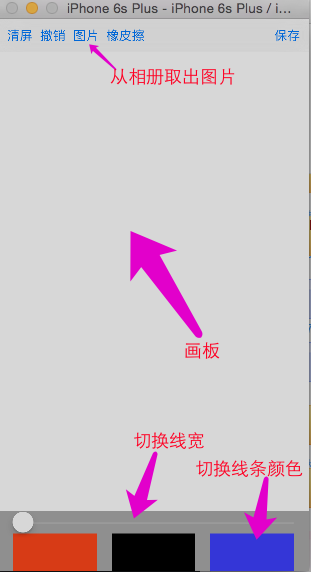

## 1.画板

### 1.1 界面效果以及功能



> 效果分析：
>
> 1> 最顶上 为一个 UIToolBar 控件，放置对于按钮
>
> 2> 中间为一个 自定义 view，用来绘制
>
> 3> 下面为一个view，有 UISlider和 3个 切换 颜色 的按钮

### 1.2 划线 以及 橡皮擦


> 1> 同一条线 如何实现 各种 位置 弯曲的？
>
> - 上面手势解锁中，只需要 一个 UIButton 和一个 结束的位置，便可以画出一个 直线，而此处需要的是 各种曲线
> - UIBezierPath 中 可以保存 addLineTo 的点，因此
> - 可以用一个 UIBezierPath类型 的属性，每次手指拖动的时候，```addLineTo```当前点即可，然后刷新画出该点
>
> 2> 多个线 不同 宽度，不同颜色 如何 实现的？
>
> - UIBezierPath 中，```setLineWidth```即可以保存 该 路线的 宽度
> - 由于颜色的设置 使用```color set``` 方式，因此，可以自定义一个 UIBezierPath 类型，添加一个 color属性即可
>
> 3> 橡皮擦功能实现
>
> - 由于 各个线是已经保存的。没法再 某条路径 几个点 擦除
> - 因此 ，可以考虑  将 画笔的颜色 设置 为  白色，达到 "擦除"的效果

### 1.3 相册取图，旋转，缩小以及 绘画到屏幕


> 1> 相册中 取出 图片的实现
>
> - 使用 UIImagePicker
>
> 2> 相册取出 图片 后，旋转 缩小 等  各种操作的实现
>
> - 取出 图片后，用一个 view ，上面 防止一个 ImageView。将该 view 添加到 控制器  view 上（此时 在 屏幕 最上层）
> - 给 ImageView  添加 各种手势，手势包含各种 形变 操作
> - 由于 添加 手势的 view ，在  缩放，旋转  等 操作的时候，其 大小，位置 都会发生变化，（上图中，红色 部分就是 ImageView 的背景色，发现 其会发生变化）。因此 添加手势 的是 ImageView 而不是 外城 view
> - 将 该 view ，化成一个图片（ImabeView 外面的范围，化成 透明即可），由于边框为 透明，因此 图片 边框 位置 已经 画的路径 不会 被遮盖
> - 将 该图片 添加到 已经绘画  的路径 中去（因为 有 顺序限制，后面可以在  该 图片 上 划线）
>
> 3> 长按 将 该 图片 画到 屏幕上，并且 只是 遮挡 该图片 位置 部分，图片 外面部分 能够 看到
>
> - 闪一下 的效果
>
>   0.25秒 时间内，将 imageview 的透明度 设置 为   透明，然后 在修改回来即可

### 1.4  项目截图


#### 1.4.1 ViewController

```objective-c

#import <UIKit/UIKit.h>

@interface ViewController : UIViewController


@end
```

```objective-c
//
//  ViewController.m
//  DrawBoard
//
//  Created by Mac on 17/3/9.
//  Copyright © 2017年 Mac. All rights reserved.
//

#import "ViewController.h"
#import "DrawView.h"
#import "DBDHandleImgView.h"

typedef NS_ENUM(NSInteger, ClickedBut){
    ClickedButRed = 100,
    ClickedButBlack,
    ClickedButGreen
};
@interface ViewController ()<UINavigationControllerDelegate, UIImagePickerControllerDelegate>
@property (weak, nonatomic) IBOutlet DrawView *drawView;

@end

@implementation ViewController

- (void)viewDidLoad {
    [super viewDidLoad];
}
/**
 *  隐藏状态栏
 */
- (BOOL)prefersStatusBarHidden{
    return YES;
}

- (void)didReceiveMemoryWarning {
    [super didReceiveMemoryWarning];
    // Dispose of any resources that can be recreated.
}
/**
 *  切换颜色
 */
- (IBAction)colorButClcked:(UIButton *)sender {
    if (sender.tag == ClickedButRed) {
        self.drawView.currColor = [UIColor redColor];
    }
    else if(sender.tag == ClickedButBlack){
        self.drawView.currColor = [UIColor blackColor];
    }
    else{
        self.drawView.currColor = [UIColor greenColor];
    }
}
/**
 *  slider  滑动
 */
- (IBAction)sliderValueChanged:(UISlider *)sender {
    self.drawView.currLineWidth = sender.value;
}
/**
 *  清屏
 */
- (IBAction)clearScreen:(UIBarButtonItem *)sender {
    [self.drawView clearScreen];
}

/**
 *  撤销
 */
- (IBAction)undo:(id)sender {
    [self.drawView undo];
}


/**
 *  橡皮擦
 */
- (IBAction)erase:(UIBarButtonItem *)sender {
    [self.drawView erase];
}

- (IBAction)save:(UIBarButtonItem *)sender {
}
/**
 *  从相册 中 选取图片
 */
- (IBAction)pic:(UIBarButtonItem *)sender {
    UIImagePickerController *imgPic = [[UIImagePickerController alloc] init];
    imgPic.delegate = self;
    BOOL isAvailable = [UIImagePickerController isSourceTypeAvailable:UIImagePickerControllerSourceTypePhotoLibrary];
    if (!isAvailable) {
        return;
    }
    imgPic.sourceType = UIImagePickerControllerSourceTypePhotoLibrary;
    [self presentViewController:imgPic animated:YES completion:nil];
    
}
/**
 * UIImagePickerController 的 代理方法
 * 选择 照片 完毕的时候 调用
 */
- (void)imagePickerController:(UIImagePickerController *)picker didFinishPickingMediaWithInfo:(NSDictionary<NSString *,id> *)info{
    UIImage *img = info[@"UIImagePickerControllerOriginalImage"];
    
    [self dismissViewControllerAnimated:YES completion:nil];
    DBDHandleImgView *handleView = [[DBDHandleImgView alloc] initWithFrame:self.view.bounds andBackImgBlock:^(UIImage *backImg) {
        self.drawView.img = backImg;
    }];
    handleView.img = img;
    [self.view addSubview: handleView];
    
}

@end

```

#### 1.4.2 DBDHandleImagView

```objective-c
//
//  DBDHandleImgView.h
//  DrawBoard
//
//  Created by Mac on 17/3/9.
//  Copyright © 2017年 Mac. All rights reserved.
//

#import <UIKit/UIKit.h>
typedef void(^ImgBlock)(UIImage * backImg);
@interface DBDHandleImgView : UIView
@property (nonatomic, strong) UIImage *img;
@property (nonatomic, copy) ImgBlock imgblock;
- (instancetype)initWithFrame:(CGRect)frame andBackImgBlock:(ImgBlock)imgblock;
@end

```

```objective-c
//
//  DBDHandleImgView.m
//  DrawBoard
//
//  Created by Mac on 17/3/9.
//  Copyright © 2017年 Mac. All rights reserved.
//

#import "DBDHandleImgView.h"
@interface DBDHandleImgView()<UIGestureRecognizerDelegate>
@property (nonatomic, strong) UIImageView *innerImgView;
@end
@implementation DBDHandleImgView

/*
// Only override drawRect: if you perform custom drawing.
// An empty implementation adversely affects performance during animation.
- (void)drawRect:(CGRect)rect {
    // Drawing code
}
*/
- (instancetype)initWithFrame:(CGRect)frame andBackImgBlock:(ImgBlock)imgblock{
    if (self = [super initWithFrame:frame]) {
        self.imgblock = imgblock;
        [self setUp];
        
    }
    return self;
}
/**
 *  设置
 */
- (void)setUp{
    /**
     *  添加 手势
     */
    [self addGesture];
    self.backgroundColor = [UIColor clearColor];
}

/**
 *  添加手势
 */
- (void)addGesture{
    /**
     *  拖拽 手势
     */
    UIPanGestureRecognizer *pan = [[UIPanGestureRecognizer alloc] initWithTarget:self action:@selector(panGesture:)];
    [self.innerImgView addGestureRecognizer:pan];
    
    /**
     *  捏合 手势
     */
    UIPinchGestureRecognizer *pin = [[UIPinchGestureRecognizer alloc] initWithTarget:self action:@selector(pinGesture:)];
    pin.delegate = self;
    [self.innerImgView addGestureRecognizer:pin];
    
    /**
     *  捏合 手势
     */
    UIRotationGestureRecognizer *rotation = [[UIRotationGestureRecognizer alloc] initWithTarget:self action:@selector(rotation:)];
    rotation.delegate = self;
    
    [self.innerImgView addGestureRecognizer:rotation];
    
    /**
     *  长按
     */
    UILongPressGestureRecognizer *longPress = [[UILongPressGestureRecognizer alloc] initWithTarget:self action:@selector(longPress:)];
    [self.innerImgView addGestureRecognizer:longPress];
}

/**
 *  拖拽 手势
 */
- (void)panGesture:(UIPanGestureRecognizer *)pan{
    CGPoint transP = [pan translationInView:pan.view];
    pan.view.transform = CGAffineTransformTranslate(pan.view.transform, transP.x, transP.y);
    //复位
    [pan setTranslation:CGPointZero inView:pan.view];
}

/**
 *  捏合 手势
 */
- (void)pinGesture:(UIPinchGestureRecognizer *)pin{
    pin.view.transform = CGAffineTransformScale(pin.view.transform, pin.scale, pin.scale);
    
    //复位
    pin.scale = 1;
}

/**
 *  旋转 手势
 */
- (void)rotation:(UIRotationGestureRecognizer *)rotation
{
    // 旋转图片
    rotation.view.transform = CGAffineTransformRotate(rotation.view.transform, rotation.rotation);
    
    // 复位,只要想相对于上一次旋转就复位
    rotation.rotation = 0;
    
}


//长按的时候调用
// 什么时候调用:长按的时候调用,而且只要手指不离开,拖动的时候会一直调用,手指抬起的时候也会调用
- (void)longPress:(UILongPressGestureRecognizer *)longPress
{
    
    if (longPress.state == UIGestureRecognizerStateBegan) {
        
        [UIView animateWithDuration:0.25 animations:^{
            //设置为透明
            self.innerImgView.alpha = 0;
        }completion:^(BOOL finished) {
            [UIView animateWithDuration:0.25 animations:^{
                self.innerImgView.alpha = 1;
                
                //把当前的View做一个截屏
                UIGraphicsBeginImageContextWithOptions(self.bounds.size, NO, 0);
                //获取上下文
                CGContextRef ctx = UIGraphicsGetCurrentContext();
                [self.layer renderInContext:ctx];
                UIImage *newImage = UIGraphicsGetImageFromCurrentImageContext();
                //关闭上下文.
                UIGraphicsEndImageContext();
                
                self.imgblock(newImage);
                
                //从父控件当中移除
                [self removeFromSuperview];
                
            }];
        }];
        
        
    }
    
}

/**
 *  懒加载 imageview
 */
- (UIImageView *)innerImgView{
    if(!_innerImgView){
        _innerImgView = [[UIImageView alloc] init];
        _innerImgView.frame = self.bounds;
        _innerImgView.contentMode = UIViewContentModeScaleAspectFit;
        _innerImgView.userInteractionEnabled = YES;
        _innerImgView.backgroundColor = [UIColor redColor];
        [self addSubview:_innerImgView];
    }
    return _innerImgView;
}

/**
 *
 */
-(void)setImg:(UIImage *)img{
    _img = img;
    self.innerImgView.image =img;
}
@end

```

#### 1.4.3 DrawView

```objective-c
//
//  DrawView.h
//  DrawBoard
//
//  Created by Mac on 17/3/9.
//  Copyright © 2017年 Mac. All rights reserved.
//

#import <UIKit/UIKit.h>

@interface DrawView : UIView
@property (nonatomic, strong) UIColor *currColor;
@property (nonatomic, assign) CGFloat currLineWidth;
@property (nonatomic, strong) UIImage *img;


/**
 *  橡皮擦
 */
- (void)erase;

/**
 *  撤销
 */
- (void)undo;

/**
 *  清屏
 */
- (void)clearScreen;
@end

```

```objective-c
//
//  DrawView.m
//  DrawBoard
//
//  Created by Mac on 17/3/9.
//  Copyright © 2017年 Mac. All rights reserved.
//

#import "DrawView.h"
#import "DBDBezierPath.h"
@interface DrawView()
/**
 *  当前 路径
 */
@property (nonatomic, strong) DBDBezierPath *currPath;
/**
 *  已经 保存 的路径
 */
@property (nonatomic, strong) NSMutableArray *pathArray;
@end
@implementation DrawView
/**
 *  懒加载方法
 */
- (UIBezierPath *)currPath{
    if (!_currPath) {
        _currPath = [DBDBezierPath bezierPath];
    }
    return _currPath;
}

- (NSMutableArray<DBDBezierPath *> *)pathArray{
    if(!_pathArray){
        _pathArray = [NSMutableArray array];
    }
    return _pathArray;
}

-(void)awakeFromNib{
    [super awakeFromNib];
    
    UIPanGestureRecognizer *pangeSture = [[UIPanGestureRecognizer alloc] initWithTarget:self action:@selector(panGesture:)];
    [self addGestureRecognizer:pangeSture];
    
    /**
     *  设置 颜色 和 线宽 的默认值
     */
    self.currLineWidth = 1;
    self.currColor = [UIColor blackColor];
    
}

- (void)panGesture:(UIPanGestureRecognizer *)pan{
    static CGPoint startP = {0,0};
    static CGPoint currP = {0,0};
    if (pan.state == UIGestureRecognizerStateBegan) {
        startP = [pan locationInView:self];
        /**
           *  每次手指 移动 刚开始的时候，重设  当前 路径
           *  开始 时，移动到 本次路径 起点
           *  保存 此路径 绘画 时的 线宽 和 颜色
           *  由于 颜色 没法 直接 存储 在 UIBezierPath 类型中：
           *  这里，自定义了一个 DBDBezierPath类型，用于 存放  颜色
           *  也可以 用一个 字典 保存 path 和 颜色，存储字典 即可
           */
        [self.currPath moveToPoint:startP];
        self.currPath.lineWidth = self.currLineWidth;
        self.currPath.currColor = self.currColor;
        self.currPath.lineJoinStyle = kCGLineJoinRound;
    }
    else if (pan.state == UIGestureRecognizerStateChanged){
        currP = [pan locationInView:self];
        /**
           *  每次手指移动时，将 当前点 加入到 当前 路径
           *  重 绘
           */
        [self.currPath addLineToPoint:currP];
        [self setNeedsDisplay];
    }
    else if (pan.state == UIGestureRecognizerStateEnded){
        /**
           *  每次 手指 移动结束，代表着 一个路径 完成
           *  将 当前路径 添加 到 已 绘制 路径中去
           */
        [self.pathArray addObject:self.currPath];
        self.currPath = nil;
    }
}

- (void)drawRect:(CGRect)rect {
    /**
     *  首先 绘制 前面已保存 的 路径
     */
    for (int i=0; i<self.pathArray.count; i++) {
        NSObject *path = self.pathArray[i];
        /**
           *  如果是图片
           */
        if ([path isKindOfClass:[UIImage class]]) {
            [(UIImage *)path drawAtPoint:CGPointZero];
        }
        else{
            [((DBDBezierPath *)path).currColor set];
            [(DBDBezierPath *)path stroke];
        }
        
    }
    /**
     *   绘制  当前 路径
     */
    [self.currPath.currColor set];
    [self.currPath stroke];
}

-(void)setImg:(UIImage *)img{
    [self.pathArray addObject:img];
    [self setNeedsDisplay];
}

/**
 *  橡皮擦
 */
- (void)erase{
    self.currColor = [UIColor whiteColor];
}
/**
 *  撤销
 */
- (void)undo{
    [self.pathArray removeLastObject];
    [self setNeedsDisplay];
}
/**
 *  清屏
 */
- (void)clearScreen{
    [self.pathArray removeAllObjects];
    [self setNeedsDisplay];
}
@end

```

#### 1.4.4 DBDBezierPath

```objective-c
//
//  DBDBezierPath.h
//  DrawBoard
//
//  Created by Mac on 17/3/9.
//  Copyright © 2017年 Mac. All rights reserved.
//

#import <UIKit/UIKit.h>

@interface DBDBezierPath : UIBezierPath
@property (nonatomic, strong) UIColor *currColor;
@end


```

```objective-c
//
//  DBDBezierPath.m
//  DrawBoard
//
//  Created by Mac on 17/3/9.
//  Copyright © 2017年 Mac. All rights reserved.
//

#import "DBDBezierPath.h"

@implementation DBDBezierPath

@end

```


