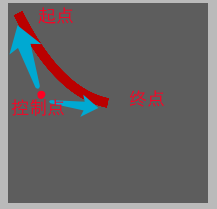
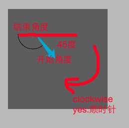

#### 1.4.1 绘制 直线

- 1> 自定义UIView
- 2> 重写drawRect方法

```objective-c
- (void)drawRect:(CGRect)rect {
    
    /**
     *  1. 获取上下文
     */
    CGContextRef ctx = UIGraphicsGetCurrentContext();
    
    /**
     *  2. 获取画笔
     */
    UIBezierPath *path = [UIBezierPath bezierPath];
    
    /**
     *  2.1 起点
     */
    [path moveToPoint:CGPointMake(10, 10)];
    
    /**
     *  2.2 划线 到 终点
     */
    [path addLineToPoint:CGPointMake(100, 100)];
    
    /**
     *  3. 保存 绘画 到 画板
     */
    CGContextAddPath(ctx, path.CGPath);
    
    /**
     *  4. 将 画板内容 渲染到  view
     *  渲染 有两种 方式 ： stroke 和 fill
     *  stroke 即：绘制 路径  (类似画笔)
     *  fill   即：填充 路径 围成 的 区域  (类似颜料桶)
     */
    CGContextStrokePath(ctx);
}
```

- 3> 绘画多条线
- 4> 设置线宽
- 5> 设置线条颜色

```objective-c
- (void)drawRect:(CGRect)rect {
    
    /**
     *  1. 获取上下文
     */
    CGContextRef ctx = UIGraphicsGetCurrentContext();
    
    /**
     *  2. 获取画笔
     */
    UIBezierPath *path = [UIBezierPath bezierPath];
    
    /**
     *  2.1 起点
     */
    [path moveToPoint:CGPointMake(10, 10)];
    
    /**
     *  2.2 划线 到 终点
     */
    [path addLineToPoint:CGPointMake(100, 100)];
    
    /**
     *  2.3 调整线宽度
     */
    [path addLineToPoint:CGPointMake(100, 50)];
    
    /**
     *  2.4 调整线宽度
     */
    CGContextSetLineWidth(ctx, 10);
    
    /**
     *  2.5 调整两个线的  交点 样式 （默认 太尖）
     */
    CGContextSetLineJoin(ctx, kCGLineJoinRound);
    
    /**
     *  2.6 设置线的颜色
     */
    [[UIColor redColor] set];
    
    /**
     *  3. 保存 绘画 到 画板
     */
    CGContextAddPath(ctx, path.CGPath);
    
    /**
     *  4. 将 画板内容 渲染到  view
     */
    CGContextStrokePath(ctx);
}
```

#### 1.4.2 绘制曲线

> 曲线绘制 与 直线 基本一致，主要其有个 控制点  ，控制其 弯曲程度，类似于拉弓的效果

- 效果



- 代码

```objective-c
- (void)drawRect:(CGRect)rect {
    
    /**
     *  1. 获取上下文
     */
    CGContextRef ctx = UIGraphicsGetCurrentContext();
    
    /**
     *  2. 获取画笔
     */
    UIBezierPath *path = [UIBezierPath bezierPath];
    
    /**
     *  2.1 起点
     */
    [path moveToPoint:CGPointMake(10, 10)];
    
    /**
     *  2.2 划线 到 终点
     */
    [path addQuadCurveToPoint:CGPointMake(100, 100) controlPoint:CGPointMake(50, 90)];
    
    /**
     *  2.4 调整线宽度
     */
    CGContextSetLineWidth(ctx, 10);

    /**
     *  2.6 设置线的颜色
     */
    [[UIColor redColor] set];
    
    /**
     *  3. 保存 绘画 到 画板
     */
    CGContextAddPath(ctx, path.CGPath);
    
    /**
     *  4. 将 画板内容 渲染到  view
     */
    CGContextStrokePath(ctx);
}
```

#### 1.4.3 第二种绘画方法

> 从画直线 看，每次都需要执行下面几个操作
>
> 1. 获取上下文
> 2. 保存 绘画 到 画板
> 3. 将 画板内容 渲染到  view
>
> 发现： 上面几步，完全没有什么变化，能不能有向类方法那样的简便，已经集成过得

```objective-c
[path stroke];
[path fill];
// 上述两个 方法，都已经 在内部集成了上面 几个方法，因此，直接一步就可以
// 但是，由于其集成上面的方法， 即：在当前方法中 获取 当前 画板，因此，必须能够 获取到画板才可以的！！即：需要在drawRect：等 提供画板的方法中
```

#### 1.4.4 画矩形(正方型一样)

```objective-c
- (void)drawRect:(CGRect)rect {
    
    UIBezierPath *path = [UIBezierPath
    		bezierPathWithRect:CGRectMake(10, 10, 50, 50)];
    		
    // 这一步 直接就可以，已经集成上面的几步了
    [path stroke];
}
```

- 圆角矩形

  ```objective-c
  bezierPathWithRoundedRect
  // 使用该方法，提供一个 圆角半径 即可
  ```

  ​

#### 1.4.5 画椭圆(圆一致)

```objective-c
- (void)drawRect:(CGRect)rect {
    // 即在一个矩形中画
    UIBezierPath *path =[UIBezierPath
        bezierPathWithOvalInRect:CGRectMake(10, 10, 50, 30)];
    [path stroke];
}
```

#### 1.4.6 画圆弧

- 效果



- 代码

```objective-c
- (void)drawRect:(CGRect)rect {
    
    UIBezierPath *path =[UIBezierPath bezierPathWithArcCenter:CGPointMake(50, 50) radius:30 startAngle:M_PI_4 endAngle:M_PI clockwise:YES];
    [path stroke];
                         
    
}
```

#### 1.4.7 画扇形

```objective-c
- (void)drawRect:(CGRect)rect {
    // 1. 画圆弧
    UIBezierPath *path =[UIBezierPath bezierPathWithArcCenter:CGPointMake(50, 50) radius:30 startAngle:M_PI_4 endAngle:M_PI clockwise:YES];
    // 2. 添加线 到 圆心
    [path addLineToPoint:CGPointMake(50, 50)];
    // 3. 封闭路径(自动添加一个 起点到终点的线)
    [path closePath];
    [path stroke];
}
```

- 如果是 fill方式的话

```objective-c
- (void)drawRect:(CGRect)rect {
    // 1. 画圆弧
    UIBezierPath *path =[UIBezierPath bezierPathWithArcCenter:CGPointMake(50, 50) radius:30 startAngle:M_PI_4 endAngle:M_PI clockwise:YES];
    // 2. 添加线 到 圆心
    [path addLineToPoint:CGPointMake(50, 50)];
    // 3. 使用fill，首先自动关闭路径(添加一个从起点到终点的线)
    [path fill];
}
```

#### 