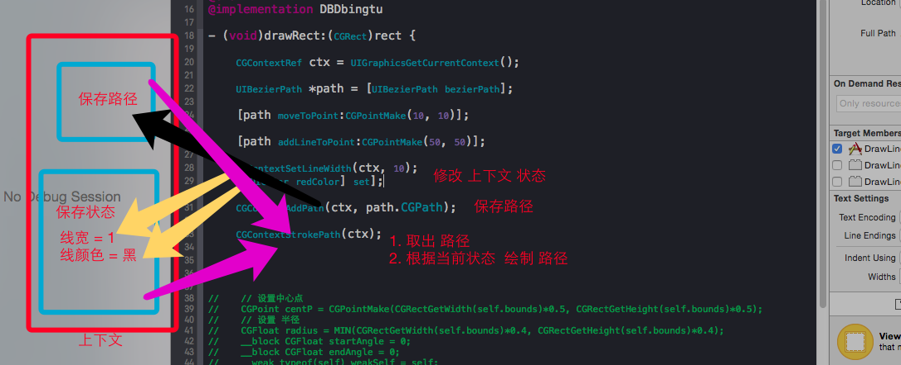

#### 1.5.5 图形上下文栈



> 1> 图形上下文 包括两个 内容
>
> - 一个用来 保存 路径
> - 一个 用来 保存 当前 状态 （线宽，颜色  等等）
>
> 2> 绘制路径的时候，刚开始 是 不会 添加 到上下文中去的，直到
>
> ``` CGContextAddPath(ctx, path.CGPath);``` 后，才会将 路径 放置到 “保存路径”的框内
>
> 3> ``` CGContextStrokePath(ctx);``` 渲染 绘画 时，会 取出 ```所有路径```，使用''保存状态''框内的  颜色，线宽 等 来 绘制 路径

- 那么，如何 绘制  两个 不同 颜色，线宽 的 直线 呢？

  > 1> 绘制一条后，重新 设置 颜色，线宽，然后 绘制 另外一条

  > 2> 使用 图形 上下文栈

  ​

#### 