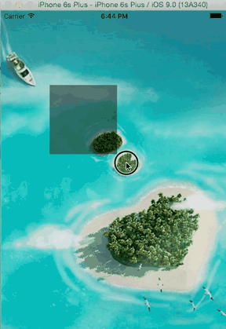

#### 1.5.8 屏幕截屏

> 原理：
>
>  	将layer上的内容，渲染到 该上下文即可
>
> - layer 需要 渲染 ！！

```objective-c
/**
     *  开启一个图片上下文
     *  CGSize size : 开启的上下文大小
     *  BOOL opaque ：不透明度。 YES：表示不透明 ；NO 表示透明
     *  CGFloat scale：如果为0，scale为设备的scale
     */
    UIGraphicsBeginImageContextWithOptions(self.view.bounds.size, NO, 0);
    CGContextRef ctx = UIGraphicsGetCurrentContext();
    
    /**
      *  将 layer的内容 渲染到 上下文中
      */
    [self.view.layer renderInContext:ctx];
    
    /**
     *  生成新的图片
     */
    UIImage *newImg = UIGraphicsGetImageFromCurrentImageContext();
    
    /**
     *  关闭上下文
     */
    UIGraphicsEndImageContext();
    
    /**
     *  压缩写入文件
     */
    NSData *jpegData = UIImageJPEGRepresentation(newImg, 1.);
    [jpegData writeToFile:@"/Users/mac/Desktop/text.jpg" atomically:YES];
```

#### 1.5.9 手选截图区域

- 效果



- 效果分析：

  > 1> 手指 可以拖动一个 选择区域，该区域为黑色，半透明
  >
  > 2> 手指 拖动结束后，截取 选中的图片，并将其设置为背景
  >
  > 3> 手指拖动结束后，选择框 消失

- 实现分析：

  > 1> 拖动区域
  >
  > - 在view上添加 拖动手势，起点为 开始拖动点，每次拖动移动时，更新view 的frame
  > - 结束拖动时，需要 移除
  > - 下一次开始拖动时，需要重新创建 =》懒加载
  >
  > 2> 背景图片变化：
  >
  > - 使用ImageView 做背景
  > - 拖动结束后，重新生成图片 作为新的背景即可

- 代码（注意点：）

> 1> cutview 懒加载 的使用
>
> 2> static CGPoint startP;
> ​    static CGPoint currentP; 需要设置 为 static  或者 property
>
> 3> ```frame= (0,0,100,100) 与 (100,100,-100,-100)```效果一致

```objective-c
- (void)viewDidLoad {
    [super viewDidLoad];
    /**
     *  添加一个屏幕大小的 imgview
     */
    UIImageView *imgView = [[UIImageView alloc] init];
    imgView.frame = self.view.frame;
    imgView.image = [UIImage imageNamed:@"test.jpg"];
    NSLog(@"%@",NSStringFromCGRect(imgView.frame));
    self.imgView = imgView;
    [self.view addSubview:imgView];
    
  	/**
     *  添加拖动手势
     */
    UIPanGestureRecognizer *panGesture = 
      	[[UIPanGestureRecognizer alloc] initWithTarget:self 
         				action:@selector(pangesture:)];
    panGesture.delegate = self;
    [self.view addGestureRecognizer:panGesture];
    
}
- (void)pangesture:(UIPanGestureRecognizer *)pangesture{
  	/**
      *  需要使用 static 或者 可以 使用 property
      *  由于 每次 手指 拖动，都会来到 该方法，如果 是 局部变量，则值被改变
      */
    static CGPoint startP;
    static CGPoint currentP;
    /**
      *  开始位置
      */
    if (pangesture.state == UIGestureRecognizerStateBegan) {
        startP = [pangesture locationOfTouch:0 
                  						inView:self.view];
    }// 每次 手指拖动后，都会到这
    else if (pangesture.state == 
             				UIGestureRecognizerStateChanged){
        currentP = [pangesture locationOfTouch:0 
                    					inView:self.view];
        /**
      	 *  根据手指 当前 位置 重新 设置 剪切区域的  frame
      	 *  这里 startP.x，startP.y 作为 x，和 y对于 结束点 在 开始点 左侧 这种 情况 同样适用因为
      	 frame= (0,0,100,100) 与 (100,100,-100,-100)效果一致
      	 */
        self.cutView.frame = CGRectMake(startP.x, startP.y, 
                                       currentP.x -startP.x, 										currentP.y-startP.y);
    }// 手指 拖动结束
    else if (pangesture.state == 	
             				UIGestureRecognizerStateEnded){
      // 重新生成 图片
			      UIGraphicsBeginImageContextWithOptions(self.view.bounds.size, NO,0);
        CGContextRef ctx = UIGraphicsGetCurrentContext();
        UIBezierPath *path = [UIBezierPath bezierPathWithRect:self.cutView.frame];
        [path addClip];
        [self.imgView.layer renderInContext:ctx];
        UIImage *newImg = UIGraphicsGetImageFromCurrentImageContext();
        UIGraphicsEndImageContext();
        self.imgView.image = newImg;
        //移除
        [self.cutView removeFromSuperview];
        self.cutView = nil;
        
    }
}
//  懒加载 方式 
- (UIView *)cutView{
    if(!_cutView){
        _cutView = [[UIView alloc] init];
        _cutView.frame = CGRectZero;
        _cutView.backgroundColor = [UIColor blackColor];
        _cutView.alpha = 0.5;
        [self.view addSubview: _cutView];
    }
    return _cutView;
}
```

#### 