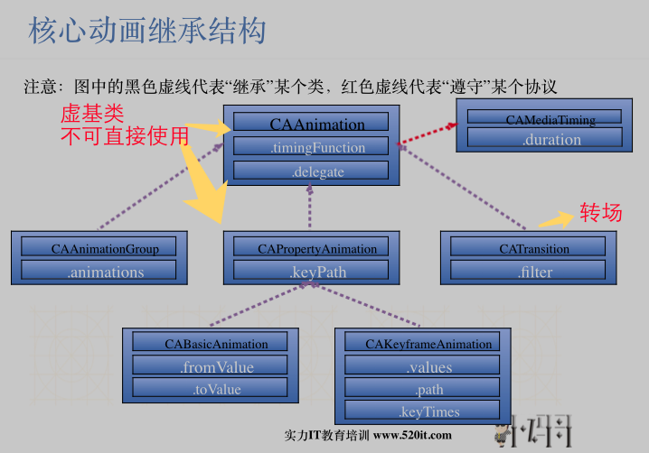

## 1. Core Animation

> 1> 是一组非常强大的动画处理 API，很少代码就可以做出 很炫酷的效果
>
> 2> 作用于 layer层，而非 view
>
> 3> 自动在后台线程处理，而不会阻塞 主线程

### 1.1 继承结构



### 1.2 使用

> 1> CAAnimation  相当于 创建一个 动画对象，然后 告诉这个 动画 对象 怎么修改 CALayer 的属性，从而使其知道 怎样 达到 动画的效果

```objective-c
/**
     *  1.创建一个 动画对象
     */
    CABasicAnimation *anim = [CABasicAnimation animation];
    /**
     *  2. 设置 CALayer 的属性
     */
    anim.keyPath = @"position.x";
    anim.toValue = @200;
    
    /**
     *  由于 动画 结束之后，会自动 移除，并回到原位置（最后一个状态）
     *  因此：需要 设置 自动移除 属性 为 NO，并且设置 最后状态为 前一个状态
     */
    anim.removedOnCompletion = NO;
    anim.fillMode = kCAFillModeForwards;
    
    /**
     *  3. 添加到 layer
     */
    [self.redView.layer addAnimation:anim forKey:nil];
```

### 1.3 CAAnimation

> 1> 所有动画对象的 父类，是抽象类，不能直接使用

#### 1.3.1属性

- duration

> 动画持续时间 

- repeatCount

> 重复次数 。 MAXFLOAT 代表 无线循环

- repeatDuration

> 重复时间

- removedOnCompletion

> 代表 动画执行 完毕之后就从 图层上移除，恢复到 动画 前 状态
>
> 如果需要 保持 动画 执行后的状态
>
> 1> 该属性 设置 为  NO
>
> 2> 设置 fillModel 为 kCAFillModeForwards

- fillMode

> 决定当前对象 在非 active 时间段的行为

- beginTime

> 可用来设置 动画延迟执行时间

- timingFunction

> 速度控制函数

- delegate

> 代理

### 1.4 CAPropertyAnimation

> 也是抽象类，继承自 CAAnimation

#### 1.4.1 属性

- keyPath

> 类似 KVC。指定 CALayer的属性名 对其 属性 进行修改

### 1.5 CABasicAnimation

#### 1.5.1 属性

- formValue

> keyPath 相应的 属性 初始值

- toValue

> keyPath 相应的 属性 结束值

- 实质

> 在长度 为 duration 的持续时间内，keyPath 从 fromValue 变为 toValue

### 1.6 CAKeyframeAnimation

> CABasicAnimation的升级版

#### 1.6.1 属性

- values

> 1> 是一个NSArray对象，里面的每个元素成为 "关键帧"(keyframe)
>
> 2> 指定的时间内，依次显示 values数组中的 每一个 关键帧

- keyTimes

> 为 values 中的关键帧 指定 对应的 时间点，取值范围 从0到1.0
>
> 每个keyTime 都对应 values 中的 每一帧
>
> 如果没有设置，各个 关键帧 时间 平分

- path

> 1> 通过设置 CGPathRef 和 CGMutablePathRef等，让图层 安装 路径轨迹进行移动
>
> 2> path 优先级 大于 values（设置path，values 被忽略）

### 1.7 CAAnimationGroup

> 1> 用来保存一组动画对象，使其同时并发运行
>
> 2> 需要将 其 加入 层

#### 1.7.1 属性

- animations

> 1>用来保存一组 动画对象
>
> 2> NSArray

> 默认情况下，一组动画是 同时运行的
>
> 但是可以设置 动画对象 的  beginTime  来 更改 开始 时间


#### 

#### 