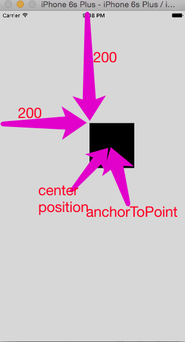
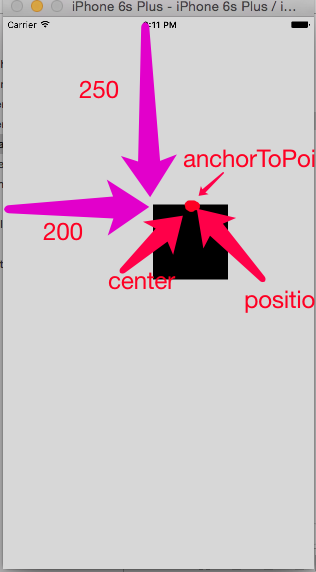

## 1.position与anchorPoint

> 都是 CALayer 的属性

### 1.1 position

> 设置 CALayer 在 父层 中 的位置
>
> 以父层 的左上角 为 原点(0,0)

### 1.2 anchorPoint

> 决定CALayer 身上 哪个点 在 position指向位置
>
> 以自身左上角 为 (0,0)

### 1.3 理解

- 确定 CALyaer 在父控件 的位置

> 1> 可以使用 frame，直接指定

> 1> 使用 position 在 父控件 指定一个 点
>
> 2> 使用 anchorPoint 决定 自身 哪个点 放在 position 位置
>
> => 也可以 确定  其 在 父控件的 位置
>
> 即:  anchorPoint  与 position 一直是重合的，相当于一个📌将 CALayer定在了 父控件 某位置

### 1.4 center 可以 不在 中心？？？

> 初始时，黑色view 的 frame为 (200,200,100,100)
>
> - 此时 anchorPoint 为 (0.5,0.5)
> - anchorPoint  center  position 三点 重合

- 将 anchorPoint 设置为 (0.5,0)

> 由于 anchorPoint 与 position 肯定重合，因此,其都在 (200,250)的位置

- 但是，此时 center 还是 与 其 三点 重合！！！

> 因此，view 的 center 属性，其实就是   layer 的position 属性
>
> 可以通过 移动 position 发现 center  同样 在一起
>
> 通过 移动 cent，发现 position 同样 在一起

