## 彩票项目开发

### 1. 项目搭建

#### 1.1 设置 层级目录

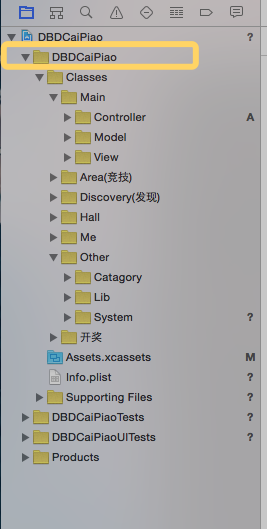

#### 1.2 info.plist 文件修改 

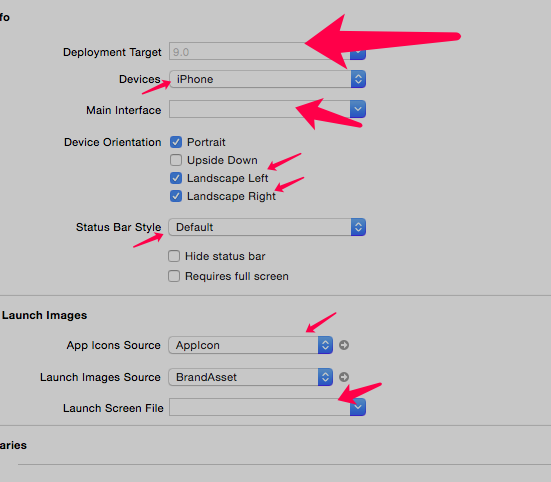

### 2. Tabbar

#### 2.1 添加 自控制器

> 1> 由于每个 子控制器 都需要 设置 tabbaritem，因此 抽取一个方法
>
> 2> 由于 自控制器 类型可能为  UIViewController UITableViewController等
>
> - 使用 其 父类 来 接受 参数

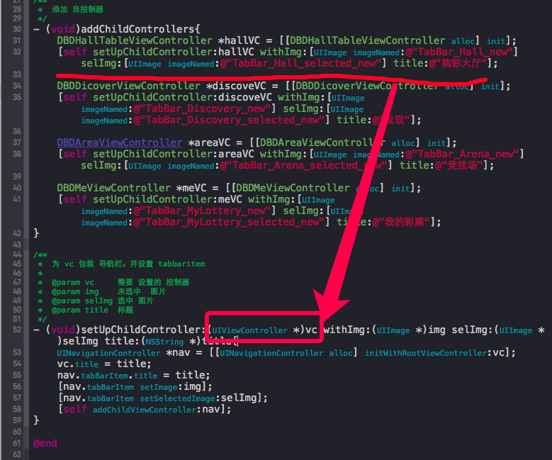

- 效果

> 1> 图片 没有显示 出来

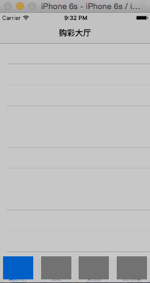

- 原因

> 图片的高度 为 49，超出 了 UITabbar能接受的最大图片大小

- 解决

> 自定义 UITabbar 

#### 2.2 自定义 UITabBar

> 1> 使用 UIView + UIButton实现
>
> 问题:
>
> 1> 如何 删除  系统自带 的 UITabBar
>
> 2> 如何 获取  需要设置的 图片，选中图片，title等
>
> 3> 点击按钮 如何 实现 切换  控制器

- 删除 系统 自带 UITabBar

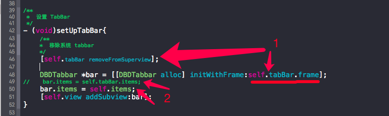

> 1> 虽然 上一级 已经 移除 self.tabBar. 但是 系统 会 在 下一次 事件循环的时候，才会 移除 没有 强引用的对象，因此 下一句 使用 self.tabBar不会 产生问题

- 如何 获取 需要设置 的 图片，选中 图片等

> 参考 系统的 UITabBar ，其中 有个 属性 items；
>
> 并且，UITabBarItem 相当于 平时 使用 的 model
>
> 因此，自定义一个 items数组，数组中 存放 UITabBarItem
>
> => 如何 拿到 UITabBarItem
>
> 2> 本来想要使用  self.tabBar.items  来给 自定义 tabbar 赋值
>
> - 但是发现 其 一直为空 ???
>
> => 每次 设置 UITabBarItem的时候，添加到 items属性中

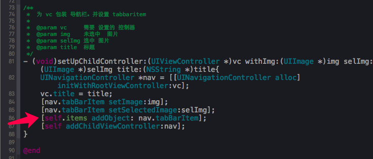

- 点击 按钮 如何 实现 切换 控制器??

> UITabbarController 有个 seletedIndex 属性，表示 选中 控制器的 序号

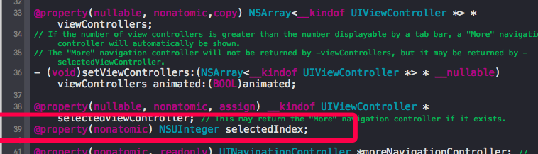

- 自定义 tabbar 中 按钮被点击，怎么修改 tabbar的 selectedindex呢

> 1> 代理
>
> 2> block

#### 2.3 自定义 UINavigation 样式

- 统一定义全部 导航栏样式

> 1> 使用  UINavigationBar  appearance 方式 ，这样修改的 是 整个应用程序的导航栏
>
> 2> 由于 直接 设置的是 整个程序的，因此只需要设置一次
>
> - 放在 load 方法中
>
> 3> 对于 initlaize 方法，父类 初始化的时候，会调用；而且 子类在 初始化的时候，同样会 调用一次 父类 的 这个方法
>
> 4> 设置 导航栏 为  红色 背景，应当设置的  是 背景图片，而非 背景颜色
>
> - 背景颜色 只是 在  20-69区域，
> - 背景图片 是在  0-69 这个区域
>
>

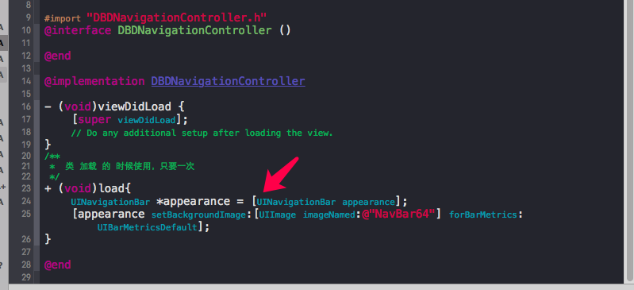

- 只是 设置  使用 此 导航栏的 ，导航栏样式

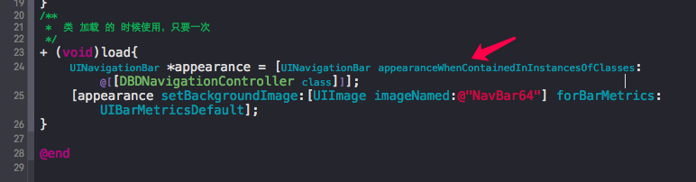

#### 2.4 统一UINavigation 返回 按钮

> 1>  由于 需要 设置 返回 按钮的地方，肯定是 push 过的 页面，因此 可以冲写 系统的 push 方法， push 之后，设置 后面控制器 的 返回 按钮

- 问题1：根控制器 同样有 返回 按钮

> 1> 由于 UINavigation 在设置 根控制器的时候，同样 会 调用  该 push 方法
>
> ；而 根控制器 不需要  返回 按钮
>
> - 因此 需要 判别 当前是否是 根控制器？
> - 可以在 push方法中，通过 查看 self.childViewController的数量来辨别

- 问题2：在push 方法中设置之后，发现 没有了 滑动 返回功能？

> **取消 代理，实现  滑动返回 ==> 解决 不能 滑动返回 问题   **     self.interactivePopGestureRecognizer.delegate = nil;

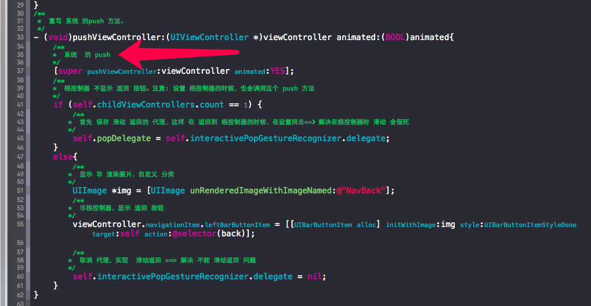

- 问题3：取消 代理之后，发现 在根控制器 滑动返回时，会出现 假死

> 由于 在 其他页面 将 代理 设置 为nil，解决了 滑动返回问题
>
> 在 主界面 需要 重新 将  代理 设置 回来
>
> - 在何处 设置 ？？
>
> 因为 返回 根控制器 需要 pop，因此 重写  pop方法
>
> - 怎么设置回来？？
>
> 用一个 属性 进行 保存，返回到主界面的时候，用此属性的值即可

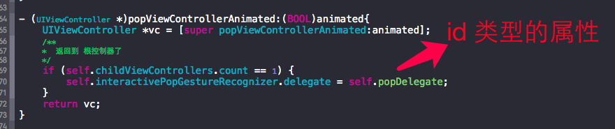

#### 2.5 子视图 进入隐藏 底部 tabbar

- 前面将 系统 tabbar 移除了，添加的自定义view，如何实现？

> 1> 取消 移除 系统的 tabbar
>
> 2> 将 自定义 的 tabbar，添加 到 系统 tabbar上面
>
> 3> 移除 系统 tabbar 中其他的按钮（只保留 自定义 tabbar 这一个 子控件）

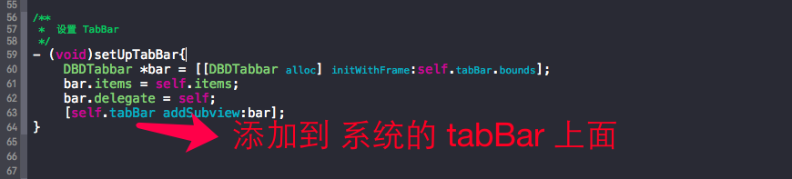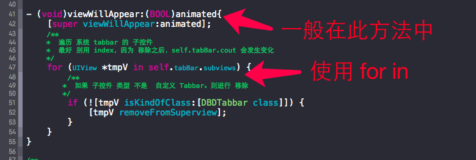

- 如何 实现 进入 子视图 隐藏 tabbar

> 如果是 使用 代码
>
> 注意：不可再 viewDidLoad 方法中，因为 此时 push已经完成

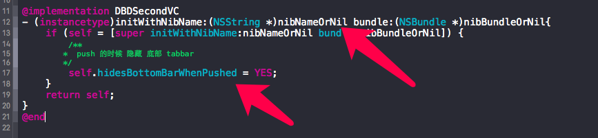

> 如果是 使用 storyboard

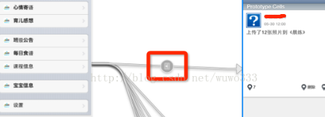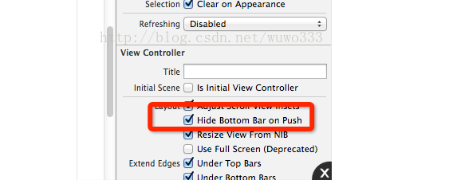

### 3. 添加 特性界面

- 如何 判断是否 应该显示 新特性 ？

> 可以 通过 将 当前 版本号，与 存储的 版本号 进行 对比。如果 版本号 不匹配，则 显示 特性 界面

- 如何 实现 滚动的 特性界面??

> 1> 使用 UIScrollView
>
> - 由于没有 重用机制，可能占用内存过大(加载高清图片太多)
>
> 2> 使用 UICollectionView

#### 3.1 UICollectionView 的使用

> 1> 与 UITableView 类似