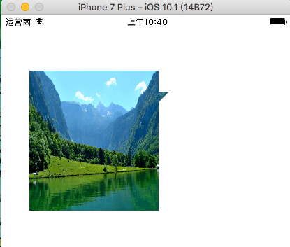
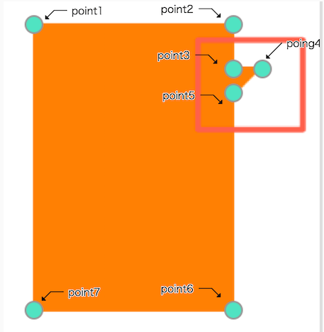
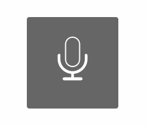
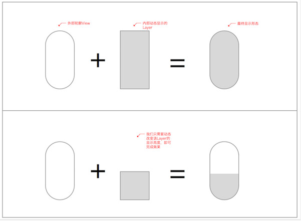

## CAShapeLayer 一些实例

#### 1. 实现复杂 view 的遮盖效果

##### 效果



即在 原 ImageView 上加一层遮盖，实现 右侧 有一个 三角形 的效果

##### 实现机制

每个view 的 layer 层 都有一个 mask 属性，该属性就是用来设置 view 的遮盖效果的。

该mask本身也是一个layer层。

该layer层 可以使用 UIBezierPath 绘画.



##### 实现

- 创建一个CAShapeLayer 的分类

```objective-c
#import "CAShapeLayer+CAShapeLayer_ViewMask.h"

@implementation CAShapeLayer (CAShapeLayer_ViewMask)

+ (instancetype) createMaskLayerWithView:(UIView *)view{
    CGFloat viewHeight = CGRectGetHeight(view.bounds);
    CGFloat viewWidth = CGRectGetWidth(view.bounds);
    CGFloat triangleWidth = 15.f;
    CGFloat triangleHeight = 15.f;
    CGFloat triangleTop = 30.f;
    
    CGPoint point1 = CGPointMake(0, 0);
    CGPoint point2 = CGPointMake(viewWidth - triangleWidth, 0);
    CGPoint point3 = CGPointMake(viewWidth - triangleWidth, triangleTop);
    CGPoint point4 = CGPointMake(viewWidth, triangleTop);
    CGPoint point5 = CGPointMake(viewWidth - triangleWidth, triangleTop + triangleHeight);
    CGPoint point6 = CGPointMake(viewWidth - triangleWidth, viewHeight);
    CGPoint point7 = CGPointMake(0, viewHeight);
    
    UIBezierPath *path = [UIBezierPath bezierPath];
    [path moveToPoint:point1];
    [path addLineToPoint:point2];
    [path addLineToPoint:point3];
    [path addLineToPoint:point4];
    [path addLineToPoint:point5];
    [path addLineToPoint:point6];
    [path addLineToPoint:point7];
    [path closePath];
    
    CAShapeLayer *layer = [CAShapeLayer layer];
    layer.path = path.CGPath;
    return layer;
}
@end
```

##### 调用

```objective-c
#import "ViewController.h"
#import "CAShapeLayer+CAShapeLayer_ViewMask.h"
@interface ViewController ()

@end

@implementation ViewController

- (void)viewDidLoad {
    [super viewDidLoad];
    // Do any additional setup after loading the view, typically from a nib.
    [self setUpImageView];
}

- (void)setUpImageView{
    UIImageView *imgView = [[UIImageView alloc] initWithFrame:CGRectMake(40, 80, 200, 200)];
    imgView.image = [UIImage imageNamed:@"test.jpg"];
    CAShapeLayer *layer = [CAShapeLayer createMaskLayerWithView:imgView];
    imgView.layer.mask = layer;
    [self.view addSubview:imgView];
}

@end
```

#### 2. 实现音量大小动态改变的控件

##### 效果



##### 实现机制



