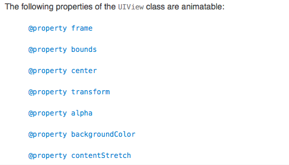

# UIView动画
### 可以操作的视图属性

- - -
### 动画执行效果（options）

###### UIView切换效果
```
 UIViewAnimationOptionTransitionNone = 0 << 20,

 UIViewAnimationOptionTransitionFlipFromLeft = 1 << 20,//从左边切入

 UIViewAnimationOptionTransitionFlipFromRight = 2 << 20,//从右边切入

 UIViewAnimationOptionTransitionCurlUp = 3 << 20,//从上面立体进入

 UIViewAnimationOptionTransitionCurlDown = 4 << 20,//从下面立体进入

 UIViewAnimationOptionTransitionCrossDissolve = 5 << 20,//溶解效果

 UIViewAnimationOptionTransitionFlipFromTop = 6 << 20,//从上面切入

 UIViewAnimationOptionTransitionFlipFromBottom = 7 << 20,//从下面切入

```

###### 动画播放的线性效果

```
   UIViewAnimationOptionCurveEaseInOut            = 0 << 16,//淡入淡出 首末减速
   UIViewAnimationOptionCurveEaseIn               = 1 << 16,//淡入 初始减速
   UIViewAnimationOptionCurveEaseOut              = 2 << 16,//淡出 末尾减速
   UIViewAnimationOptionCurveLinear               = 3 << 16,//线性 匀速执行  
```

###### 基础属性的设置
```
   UIViewAnimationOptionLayoutSubviews            = 1 <<  0,//设置子视图随父视图展示动画
   UIViewAnimationOptionAllowUserInteraction      = 1 <<  1,//允许在动画执行时用户与其进行交互
   UIViewAnimationOptionBeginFromCurrentState     = 1 <<  2,//允许在动画执行时执行新的动画
   UIViewAnimationOptionRepeat                    = 1 <<  3,//设置动画循环执行
   UIViewAnimationOptionAutoreverse               = 1 <<  4,//设置动画反向执行，必须和重复执行一起使用
   UIViewAnimationOptionOverrideInheritedDuration = 1 <<  5,//强制动画使用内层动画的时间值
   UIViewAnimationOptionOverrideInheritedCurve    = 1 <<  6,//强制动画使用内层动画曲线值
   UIViewAnimationOptionAllowAnimatedContent      = 1 <<  7,//设置动画视图实时刷新
   UIViewAnimationOptionShowHideTransitionViews   = 1 <<  8,//设置视图切换时隐藏，而不是移除
   UIViewAnimationOptionOverrideInheritedOptions  = 1 <<  9,//
```
- - - ​
### 方式一
```
+ (void)animateWithDuration:(NSTimeInterval)duration 
        animations:(void (^)(void))animations;

```
其中：

    duration：动画执行的时长

    animations：要执行的动画动作

### 方式二

```
+ (void)animateWithDuration:(NSTimeInterval)duration 
        animations:(void (^)(void))animations 
        completion:(void (^)(BOOL finished))completion;

```
其中：

    block：block块中可以添加一个动画执行结束后的动作

### 方式三

```
+ (void)animateWithDuration:(NSTimeInterval)duration 
        delay:(NSTimeInterval)delay 
        options:(UIViewAnimationOptions)options 
        animations:(void (^)(void))animations 
        completion:(void (^)(BOOL finished))completion;

```
其中：

    delay：延时执行

    options：动画效果

### 方式四

```
+ (void)animateWithDuration:(NSTimeInterval)duration 
        delay:(NSTimeInterval)delay 
        usingSpringWithDamping:(CGFloat)dampingRatio 
        initialSpringVelocity:(CGFloat)velocity 
        options:(UIViewAnimationOptions)options 
        animations:(void (^)(void))animations 
        completion:(void (^)(BOOL finished))completion;

```
ios 7之后（效果酷炫）
其中：
    dampingRatio: 弹簧效果的强弱，设置1则没有回弹效果，设置0则会剧烈的阻尼回弹
    velocity: 设置弹簧的初始速度

