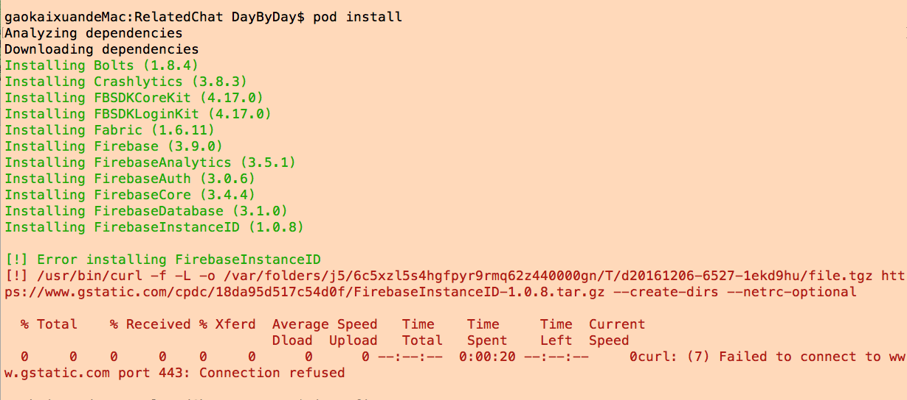

### 1. 没有输入时，UITextField部位空？

```
//输入框没有输入数据时
if(_textField.text == nil)
返回值为 false？？？
```

* 判断是否为空，可用

```
if(_textField.text.length == 0)
//为空，返回true
```

---

### 2. NSString 将空格转为 %20

```
[myString stringByReplacingPercentEscapesUsingEncoding:NSUTF8StringEncoding];
```

---

##### 将%20转为空格

```
stringRemove....方法
```

### 3. NSDictionary 的 key中出现Nstaggedpointerstring类型

* 本来应当为NSString类型，但是查看却是Nstaggedpointerstring类型

  ###### 解决

* 将NSString 的类型声明为 copy 即可


---

### 4. iOS Xcode下报 "xx" is missing from working copy的问题

原因：在项目提交过svn后，再在本机上删除不用的图片资源后，build便会有此提示
解决：

```
cd 到警告所提示的文件夹下(直到找不到文件夹的上一级文件夹路径)
//直接删除置顶文件夹下所有SVN相关
执行  sudo find . -type d -name .svn | xargs rm -rf
```

### 5. AFNetworking 提交请求时，服务器端获取 User-Agent为空

原因：由于在设置User-Agent时，第一个字符串为app名称，当app名称为中文时，便会出现这个问题
解决：在AFHTTPClient的
setDefaultHeader:\(NSString _\)header value:\(NSString _\)value 函数中，将设置User-Agent的中文内容改为英文即可。

---

### 6. CocoaPods报错

#### 6.1 执行pod install 出现下面错误

    Analyzing dependencies

    [!] The dependency `DOUAudioStreamer (= 0.2.11)` is not used in any concrete target.

    The dependency `SDWebImage` is not used in any concrete target.

    The dependency `GVUserDefaults` is not used in any concrete target.

    The dependency `MBProgressHUD` is not used in any concrete target.

    The dependency `Mantle (= 1.5.5)` is not used in any concrete target.

    The dependency `AFNetworking (~> 2.0)` is not used in any concrete target.

#### 6.2 解决（修改Podfile文件的内容）

##### 6.2.1 Podfile 原内容

```
source 'https://github.com/CocoaPods/Specs.git'

pod 'DOUAudioStreamer', '0.2.11'pod 'SDWebImage'pod 'GVUserDefaults'pod 'MBProgressHUD'pod 'Mantle', '1.5.5'pod 'AFNetworking', '~> 2.0'

```

##### 6.2.2 Podfile 修改为

```
source 'https://github.com/CocoaPods/Specs.git'

target ‘Enesco’ do

pod 'DOUAudioStreamer', '0.2.11'
pod 'SDWebImage'
pod 'GVUserDefaults'
pod 'MBProgressHUD'
pod 'Mantle', '1.5.5'
pod 'AFNetworking', '~> 2.0'
end
```

其中‘Enesco’，为工程  TARGET名称
然后在执行  `pod install`

### 7 iOS8.0以上系统下无法通过代码创建被删除过的同名相册

#### 7.1 错误描述

```
Error Domain=LIB_ALAssetsLibrary_CustomPhotoAlbum 
Code=0 
"ALAssetsGroup failed to add asset: ALAsset - Type:Photo, 
URLs:assets-library://asset/asset.PNG?id=34FFE0D1-08BB-45DA-9C91-50D96F6158B9&ext=PNG." 
UserInfo=0x17927cec0 
{NSLocalizedDescription=ALAssetsGroup failed to add asset: ALAsset - Type:Photo, 
URLs:assets-library://asset/asset.PNG?id=34FFE0D1-08BB-45DA-9C91-50D96F6158B9&ext=PNG
```

#### 7.2 原因

iOS 8.0 之后, 相册新增了 Recently Deleted \(最近删除\) 这个功能, 导致我们在相册里边手动删除 "Rd"相册 是并没有完全删除, 导致创建相册虽然成功, 但却为 group 却为nil

因此：ALAssertLibrary创建相册，如果该相册被删除过了，则会失败

#### 7.3 解决

IOS8之后使用了新的库PHPhotoLibrary代替ALAssetsLibrary

### 8 PHPhotoLibrary的使用\(兼容iOS8以前\)

#### 8.1 导入库Photo.framework

* 注意: 导入库时，选项应当为  optional,否则你的应用就必须支持IOS8以及以上了

#### 8.2 包含头文件

```
#ifdef __IPHONE_8_0
#import <Photos/Photos.h>
#endif

```

* 注意：与处理语句的使用，防治在ios6,7等上没有该头文件导致错误

#### 8.3 修改处理函数

```
- (void)addAssetURL:(NSURL *)assetURL
            toAlbum:(NSString *)albumName
         completion:(ALAssetsLibraryWriteImageCompletionBlock)completion
            failure:(ALAssetsLibraryAccessFailureBlock)failure
{
    //前面的不需要修改
    ...
    /*
     *  主要是在此if语句中，新添加了一个 iOS8及以上 系统的处理（PHPhotoLibrary的使用在此处）
     *  此if语句中，原有的处理语句，全部放到 if(iOS8) 的else里面去了
     *／
    if (group == nil && albumWasFound == NO) {

        /** 如果是iOS8以及以上版本*/
        if(iOS8)
        {
／**
  *   预处理语句的使用,否则在ios7上会找不到该库出错
  *／
#ifdef __IPHONE_8_0
            __weak ALAssetsLibrary *weakSelf = self;
            [[PHPhotoLibrary sharedPhotoLibrary] performChanges:^{
                [PHAssetCollectionChangeRequest creationRequestForAssetCollectionWithTitle:albumName];
            } completionHandler:^(BOOL success, NSError * _Nullable error) {
                if(success)
                {
                    [weakSelf enumerateGroupsWithTypes:ALAssetsGroupAlbum usingBlock:^(ALAssetsGroup *group, BOOL *stop) {
                        if([albumName compare:[group valueForProperty:ALAssetsGroupPropertyName]] == NSOrderedSame)
                        {
                            [weakSelf assetForURL:assetURL resultBlock:^(ALAsset *asset) {

                                if ([group addAsset:asset]) {
                                    // Run the completion block if the asset was added successfully
                                    if (completion) completion(assetURL, nil);
                                }
                                // |-addAsset:| may fail (return NO) if the group is not editable,
                                //   or if the asset could not be added to the group.
                                else {
                                    NSString * message = [NSString stringWithFormat:@"iOS 8 and above failed to add asset: %@.", asset];
                                    failure([NSError errorWithDomain:@"LIB_ALAssetsLibrary_CustomPhotoAlbum"
                                                                code:0
                                                            userInfo:@{NSLocalizedDescriptionKey : message}]);
                                }

                            } failureBlock:failure];
                        }
                    } failureBlock:failure];
                }
            }];
#endif
        }else{
        //原if语句中的处理，放到此处执行
        //用来兼容以前
        }
}
```
- - -
### 9 iOS10 KeychainItemWrapper crash
- 解决： 项目设置-> Capabilities -> Keychain Sharing 设置为ON
  s

---
### 10 Pod安装 FirebaseInstanceID错误
#### 10.1 错误描述
> Failed to connect to www.gstatic.com port 443: Connection refused

#### 10.2 图片

#### 10.3 解决
原因在于：虚拟机的网络设置
- 将 网络修改为 桥接 模式
- 如果为笔记本，选择 复制网络

### 11 Undefined symbols for architecture x86_64: “_OBJC_CLASS_$_CMMotionManager”

- 一般原因为：缺少CoreMotion.framework

### 12 删除NSUserDefaults数据时，出现错误

mutableCopy 的使用，否则  NSMutableArray 指向 NSUserDefaults 中数据，在将其全部删除时（Array为空），此时，NSUserDefaults中会出错（存储数据为空）
```
/**
 *  删除 NSUserDefaults 中的 数据
 */
- (void)removeDataFromNSUserDefaults:(NSString *)userName{
    
    NSUserDefaults *defaults = [NSUserDefaults standardUserDefaults];
    NSMutableArray *addFriendRequest = [[defaults objectForKey:@"addFriendRequest"] mutableCopy];
    for(NSDictionary *dict in addFriendRequest){
        if([userName isEqualToString:dict[@"userName"]]){
            [addFriendRequest removeObject:dict];
            break;
        }
    }
    if(addFriendRequest.count != 0){
        [defaults setObject:addFriendRequest forKey:@"addFriendRequest"];
    }
    else{
        [defaults removeObjectForKey:@"addFriendRequest"];
    }
    
}
```

### 13 for...in 删除时出现crash错误
#### 13.1 运行的时候crash掉了
```
for (NSString*str in self.btnArray) {
        if ([imageName isEqualToString:str]) {
            [self.btnArray removeObject:str];
        }
    }
```
#### 13.2 原因：

> 快速遍历是根据enumerator对象内部的计数器，调用nextObject方法来返回下一个数组元素。这种方式，一开始应当一次就把所有额enumerator对象全部创建好了，如果此时删除数组中一个元素，enumerator是不会reset的，即后面enumeration会找不到对应的数组元素，造成crash

---
#### 13.3 解决
###### 1> 正常for版本
正常处理
```
for(int i = 0; i < self.btnArray.count; i++) {
        if ([imageName isEqualToString:self.btnArray[i]]) {
            [self.btnArray removeObject:self.btnArray[i]];
        }
    }
```
---

###### 2> 只需处理一次的 for..in
使用block可以正常执行，但是只会处理一次

```
for (NSString*str in self.btnArray) {
        if ([imageName isEqualToString:str]) {
            [self.btnArray removeObject:str];
            break;
        }
    }
```
###### 3> 使用副本

使用副本进行遍历，使用原数组进行删除

```
NSMutableArray *copyArray = [NSMutableArray arrayWithArray:self.btnArray];
for (NSString*str in copyArray) {
        if ([imageName isEqualToString:str]) {
            [self.btnArray removeObject:str];
        }
    }
```

###### 4> 逆序遍历，查找后删除
正序时，如果删除一个，则后方未遍历的位置会向前移动一位，这样后面可能会有enumerator找不到数组元素造成crash
逆序时，如果删除一个，改变的是后方元素（已经遍历过），对于未遍历的则没有影响
```
NSEnumerator *enumerator = [array reverseObjectEnumerator];

for(AddressPerson *groupName in enumerator){
    if(处理){
    [array removeObject:groupName];
    }
}
```

### 14 [__NSCFArray insertObject:atIndex:]: mutating method sent to immutable object

#### 14.1 原因
沙盒存储只能存储基本类型,int string 字典 数组等 均是不可变的,因此在存储时候,将存入可变数据源数组 转化为了不可变数组,当再次获取的时候,其实获取的数据源数组本质是不可变数组
#### 14.2 解决

```
NSArray *array = [[NSUserDefaults standardUserDefaults] valueForKey:@"ReceivedMsg"];
NSMutableArray *copyArray = [NSMutableArray arrayWithArray:array];
//对 copyArray进行处理

array = copyArray;
```


