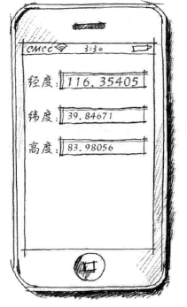
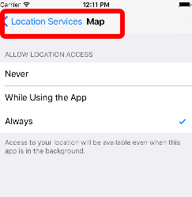
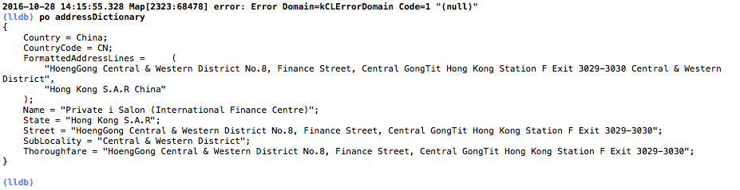

## 定位服务

##### 分类

* wifi
  * 通过wifi路由器的地理位置查询，省电

* 蜂窝式基站
  * 通过移动运营商基站定位，费流量

* gps
  * 通过gps卫星定位，准确，耗电量大，且不能遮挡


---

##### 特点

* ios屏蔽底层细节，且根据设备情况，自动选择最佳解决方案：gps&gt;wifi&gt;蜂窝式基站

##### 编程

###### core location框架

* CLLocationManager:用于定位服务管理类，提供位置信息和高度信息，可监控设备进入或离开某个区域，且可获得设备的运行方向
* CLLocationManagerDelegate:上述类的委托协议
* CLLocation: 封装了位置和高度信息
  ##### 代码

  ###### ViewController.h


```
#import <UIKit/UIKit.h>
#import <CoreLocation/CoreLocation.h>
#import <CoreLocation/CLLocationManagerDelegate.h>
@interface ViewController : UIViewController<CLLocationManagerDelegate>
/**
 * 经度
 */
@property (weak, nonatomic) IBOutlet UITextField *txtLng;
/**
 * 纬度
 */
@property (weak, nonatomic) IBOutlet UITextField *txtLat;
/**
 * 高度
 */
@property (weak, nonatomic) IBOutlet UITextField *txtAlt;
@property (strong, nonatomic) CLLocationManager *locationManager;
@end

```

###### ViewController.m

```
#import "ViewController.h"
@interface ViewController ()
@end
@implementation ViewController

- (void)viewDidLoad {
 [super viewDidLoad];
 // Do any additional setup after loading the view, typically from a nib.
 /**
 * 初始化定位服务管理对象
 */
 _locationManager = [[CLLocationManager alloc] init];
 _locationManager.delegate = self;
/**
 * 精确度：
 * kCLLocationAccuracyBest：表示设备使用电池供电时最高的精度
 */
 _locationManager.desiredAccuracy = kCLLocationAccuracyBest;
 /**
 * 距离过滤器：设备移动多少距离之后，才会获得位置信息
 */
 _locationManager.distanceFilter = 1000.0f;
}

- (void)viewWillAppear:(BOOL)animated
{
 [super viewWillAppear:animated];
 /**
 * 开始定位
 */
 [_locationManager startUpdatingLocation];
}

- (void)viewDidDisappear:(BOOL)animated
{
 [super viewDidDisappear:animated];
 /**
 * 停止定位
 */
 [_locationManager stopUpdatingLocation];
}
/**
 * 委托方法：定位成功
 */
- (void)locationManager:(CLLocationManager *)manager didUpdateLocations:(NSArray<CLLocation *> *)locations
{
 /**
 * locations是位置变化的集合，按照事件变化的顺序存放

 */
 CLLocation *currLocation = [locations lastObject];
 _txtLat.text = [NSString stringWithFormat:@"%3.5f",currLocation.coordinate.latitude];
 _txtLng.text = [NSString stringWithFormat:@"%3.5f",currLocation.coordinate.longitude];
 _txtAlt.text = [NSString stringWithFormat:@"%3.5f",currLocation.altitude];
}
/**
 * 委托方法：定位失败
 */
- (void)locationManager:(CLLocationManager *)manager didFailWithError:(NSError *)error
{
 NSLog(@"error: %@",error);
}
- (void)didReceiveMemoryWarning {
 [super didReceiveMemoryWarning];
 // Dispose of any resources that can be recreated.
}
@end

```

###### 界面及结果


###### 模拟器设置

* 首先在xcode的produce-》scheme-》edit scheme

###### 打开定位服务

- - -
## 地理信息反编码
上图的结果，经度，纬度等是具体的数值，需要转化为文字描述
###### 使用CLGeocoder实现

```
- (IBAction)click:(id)sender {
 CLGeocoder *geocoder = [[CLGeocoder alloc] init];
 [geocoder reverseGeocodeLocation:_currentLocation completionHandler:^(NSArray<CLPlacemark *> * _Nullable placemarks, NSError * _Nullable error) {
 if([placemarks count] > 0)
 {
 CLPlacemark *placemark = placemarks[0];
 NSDictionary *addressDictionary = placemark.addressDictionary;
 NSString *address = [addressDictionary objectForKey:CNPostalAddressStreetKey];
 address = address == nil ? @"":address;
 NSString *state = [addressDictionary objectForKey:CNPostalAddressStateKey ];
 state = state == nil ? @"":state;
 NSString *city = [addressDictionary objectForKey:CNPostalAddressCityKey];
 city = city == nil ? @"":city;
 _showLabel.text = [NSString stringWithFormat:@"%@ \n %@ \n %@",state,address,city];
 }
 }];
}

```
###### 其中获得的addressDictionary为



