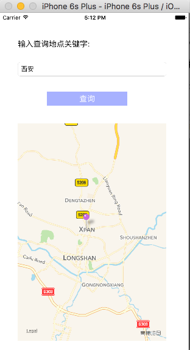
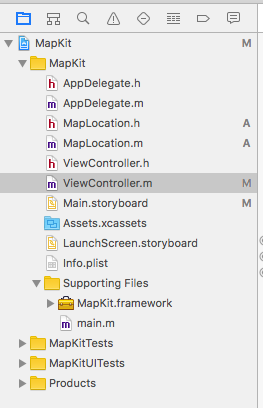

## 地图
###### 效果图

##### Map Kit
- 显示地图的视图是 MKMapView
- 委托协议是 MKMapViewDelegate
###### 项目目录

##### 代码
###### MapLocation.h


```
#import <Foundation/Foundation.h>
#import <MapKit/MapKit.h>
@interface MapLocation : NSObject<MKAnnotation>


/**
 *  街道信息属性
 */
@property (nonatomic, copy) NSString *streetAddress;
/**
 *  城市信息属性
 */
@property (nonatomic, copy) NSString *city;
/**
 *  州，省，市
 */
@property (nonatomic, copy) NSString *state;
/**
 *  邮编
 */
@property (nonatomic, copy) NSString *zip;
/**
 *  地理坐标
 */
@property (nonatomic, readwrite) CLLocationCoordinate2D coordinate;


@end

```

###### MapLocation.m

```

#import "MapLocation.h"

@implementation MapLocation
/**
 *  标注点上的主标题
 */
-(NSString *)title
{
    return @"您的位置!";
}
/**
 *  标注点上的副标题
 */
-(NSString *)subtitle
{
    NSMutableString *ret = [NSMutableString new];
    if(_state)
    {
        [ret appendString:_state];
    }
    if(_city)
    {
        [ret appendString:_city];
    }
    if(_city && _state)
    {
        [ret appendString:@",  "];
    }
    if(_streetAddress && (_city || _state || _zip))
    {
        [ret appendString:@"  *  "];
    }
    if(_streetAddress)
    {
        [ret appendString:_streetAddress];
    }
    if(_zip)
    {
        [ret appendFormat:@",  %@",_zip];
    }
    return ret;
}
@end
```
###### ViewController.m
```
#import "ViewController.h"

#import <MapKit/MapKit.h>

#import "MapLocation.h"

@interface ViewController ()<MKMapViewDelegate>

@property (weak, nonatomic) IBOutlet UITextField *searchText;

- (IBAction)searchButton:(id)sender;

@property (weak, nonatomic) IBOutlet MKMapView *mapView;


@end


@implementation ViewController


- (void)viewDidLoad {

 [super viewDidLoad];

 // Do any additional setup after loading the view, typically from a nib.

 /**

 * 地图类型

 * MKMapTypeStandard :标注地图类型

 * MKMapTypeSatellite :卫星地图类型

 * MKMapTypeHybrid :混合地图类型

 */

 _mapView.mapType = MKMapTypeStandard;

 _mapView.delegate = self;

}

/**

 * 在地图视图上添加标注点，需要

 * 1）触发添加动作

 * 2）实现地图委托方法

 */

/**

 * 1）通过 “查询” 按钮触发添加标注动作

 *

 */

- (IBAction)searchButton:(id)sender {

 if(_searchText.text ==nil || [_searchText.text length] == 0)

 {

 return ;

 }

 CLGeocoder *geocoder = [[CLGeocoder alloc]init];

 [geocoder geocodeAddressString:_searchText.text completionHandler:^(NSArray<CLPlacemark *> * _Nullable placemarks, NSError * _Nullable error) {

 NSLog(@"查询记录数: %li",(unsigned long)[placemarks count]);

 /**

 * 本次查询，首先清除地图上现有的标注点

 */

 if([placemarks count] > 0)

 {

 [_mapView removeAnnotations:_mapView.annotations];

 }

 for(int i=0;i<[placemarks count];i++)

 {

 CLPlacemark *placemark = placemarks[i];

 [_searchText resignFirstResponder];

 /**

 * 调整地图位置和缩放比例

 */

 MKCoordinateRegion viewRegion = MKCoordinateRegionMakeWithDistance(placemark.location.coordinate, 10000, 10000);

 [_mapView setRegion:viewRegion animated:YES];


 MapLocation *annotation = [[MapLocation alloc] init];

 annotation.streetAddress = placemark.thoroughfare;

 annotation.city = placemark.locality;

 annotation.state = placemark.administrativeArea;

 annotation.zip = placemark.postalCode;

 annotation.coordinate = placemark.location.coordinate;


 [_mapView addAnnotation:annotation];

 }

 }];

}

/**

 * 2) 实现地图委托方法 mapView:viewForAnnotation:

 */

- (MKAnnotationView *)mapView:(MKMapView *)mapView viewForAnnotation:(id<MKAnnotation>)annotation

{

 MKPinAnnotationView *annotationView = (MKPinAnnotationView *)[_mapView dequeueReusableAnnotationViewWithIdentifier:@"PIN_ANNOTATION"];

 if(annotationView == nil)

 {

 annotationView = [[MKPinAnnotationView alloc] initWithAnnotation:annotation reuseIdentifier:@"PIN_ANNOTATION"];

 }


 annotationView.pinColor = MKPinAnnotationColorPurple;

 annotationView.animatesDrop = YES;

 annotationView.canShowCallout = YES;


 return annotationView;

}

@end

```
