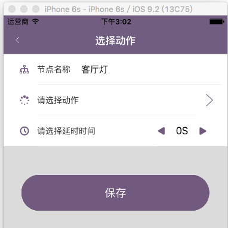

## 1> 同一session的cell差距不大

### 1.1> 思路

- 1） storyboard中创建3个cell。TitleCell.TimeCell.ArrowCell
- 2） 对于3个cell，创建3个model,且全部继承自BaseModel。TitleModel.TimeModel.ArrowModel
- 3） 在 cellForRow..方法中
    - i. 取出model
    - ii. 判断该model的类型（分别与TitleModel.TimeModel.ArrowModel比较），创建对应的cell（根据cell标识）
    - iii. 对该cell设置对于模型
